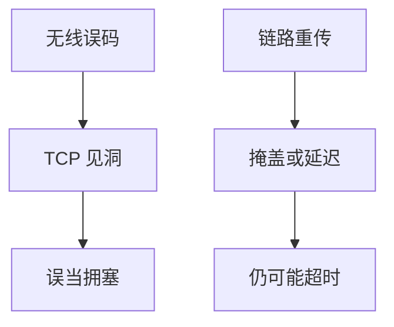

# 无线上的 TCP

空口误码与切换造成的丢包不是管道满；TCP 若当拥塞减窗，就把完好的 $C$ 浪费掉。

<footer>—— 据 RFC 3481 2.5G/3G 上的 TCP；Balakrishnan et al. 无线 TCP 综述整理</footer>

[卫星](/cs/satellite-latency) 已给误码≠拥塞。[802.11 ACK](/cs/wifi-frames-ofdm) 做链路重传。[上一课](/cs/delay-based-cc) 的延迟信号也会被调度抖动污染。缺口是**蜂窝/Wi‑Fi 上的 TCP 行为**：ELN、PEPs、链路 ARQ 与 RTO。本课结束新传输课序。

## 问题

无线丢：衰落、碰撞、切换。链路 ARQ 已努力，仍可能超时。TCP 看到洞就 MD 或 RTO。对策分层：更好的链路 FEC/ARQ（PHY 课）、显式失错通知（少见）、冻结窗口在切换时、PEP 拆连接（破坏端到端）、BBR/延迟 CC 少抽空、QUIC 快速探测。5G URLLC 走专切片，不靠修 TCP。

不要把「无线 TCP」写成换一个 cc 算法名就结束。

RFC 3481。中间 PEP 有争议（Saltzer）。本课列机制，不推销拆连接。

### 空口丢≠管道满

链路 ARQ 会掩盖或推迟。假 MD 浪费 $C$。PEP 破端到端。先问链路再改 CC。URLLC 走切片不靠修 TCP。

## 方法

对照：拥塞丢 vs 无线丢。画：空口丢 → 假 MD → 吞吐低于 $C$。与 MPTCP：坏口切子流。与 RoCE：无线一般不跑无损 RDMA。

方法止于选定对象与对照；机制才说它如何嵌入已有分层与主干课。

## 机制

缓冲膨胀在 LTE 基站很重，交互差。AQM 在基站有帮助。窗口缩放仍要，BDP 随无线 $C$ 变。MSS 小一点抗误码重传代价，与容量摊销权衡。抓包看到的 RTT 含调度，不是传播。

端到端：应用 FEC（实时后课）比 PEP 更符合 Saltzer。

## 边界

本课不引入 Snoop TCP 的全部代理状态。HTTP/1.1 持久连接是下一单元第一课。后课默认：无线丢包要先问链路，再问 CC。

把 RTO 下限盲目降到微秒会在公网误触发。

上一课留下的缺口在本课收口；「无线上的 TCP」进入后课词汇表后只引用。文献用来钉对象与边界，不把本课写成该主题的独立综述。下一课[HTTP/1.1 持久连接与分块](/cs/http11-persistent-chunked)。

## 小结

- 无线丢失≠瓶颈满。
- 链路 ARQ、谨慎 CC、多径是配套。
- PEP 换性能、破端到端。
- 后课只引用本课钉死的对象，不从该领域总问题重开。
- 出处：RFC 3481；无线 TCP 文献。
