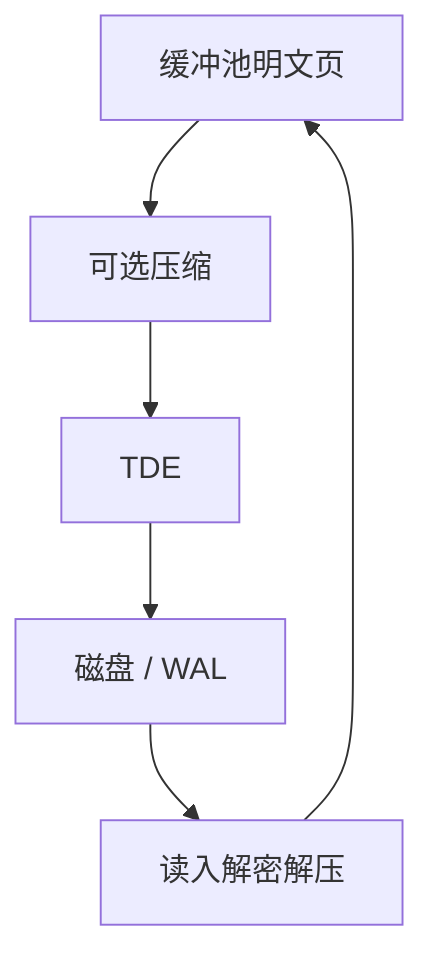

# 透明加密与压缩

TDE 在页写出时加密、读入时解密，应用 SQL 不变；页压缩同样夹在缓冲与磁盘之间，改变的是 I/O 体积与 CPU。

<footer>—— 据 NIST 对静态加密；数据库 TDE 实践；页压缩与 InnoDB/Oracle 文档对照</footer>

[上一课](/cs/table-partitioning)水平切堆。本课不裁剪分区。缺口是页离开缓冲池之后还是不是明文、是不是原体积。透明数据加密（TDE）与页压缩对查询指称透明，对 WAL、备份、CPU 校准不透明。缓冲、索引与格式序列在此收口，引擎对照下一序列。

## 问题

磁盘被盗或备份流泄漏：无 TDE 则页是明文。TDE：数据页（及常包括 WAL）用文件密钥加密，主密钥在 KMS 或钱包。缺口是**密钥寿命与性能**：每页加解密，随机 I/O CPU 涨；要与代价校准对齐。压缩：页内压缩减少磁盘与备份，更新可能触发解压-改-再压，碎片增加。

不能把 TDE 当行级权限：拿到密钥的实例仍能 `SELECT` 全部。行级安全后课。也不能当通信加密：客户端 TLS 是另一层。

透明指对 SQL 与数据类型透明。密钥轮换要重加密或信封加密双密钥。本课不设计 KMS。压缩与列编码不同：这里是行页gzip/lz4一类，列编码在列存课。

## 方法

写出路径：pin 页 → 可选压缩 → 加密 → I/O。读入相反。校验和在加密内或外要定义，以免密文损坏当随机密钥。备份：物理备份已是密文则备份介质安全依赖于密钥不在同一包。

只压索引或只压冷分区是策略。与 DOUBLEWRITE 后课：加密页的撕裂保护仍要原子写语义。

## 机制

复制：物理复制传密文，备库要同密钥；逻辑复制解码行则在主库明文侧抽，备库重放明文 SQL——安全边界不同。性能：压缩可能先于加密（体积小再加密）。扫描污染：解压后页进池仍按 LRU-K。

随机探测：压得越大 CPU 越重，点查未必赚。分析扫顺序大页更赚。

## 边界

本课不对比 InnoDB 聚簇与 Postgres 堆——下一课。也不把应用层字段加密（保留搜索的可搜索加密）当 TDE。可搜索加密研究不进主干必做。

后课默认：静态加密与页压缩在 I/O 路径上；密钥与 KMS 是运维合同。引擎对照：同样 TDE 思想，页格式与 undo 不同。

透明不是无代价。校准与备份密钥要一起做。

## 小结

- TDE 与页压缩夹在缓冲与磁盘之间，SQL 不变、代价变。
- 不替代 TLS 与行级权限。
- 下一序列 InnoDB 对 Postgres 堆：两种行家的页与聚簇。
- 出处：NIST 静态加密；TDE/页压缩实践；Gray 对 I/O 路径。
