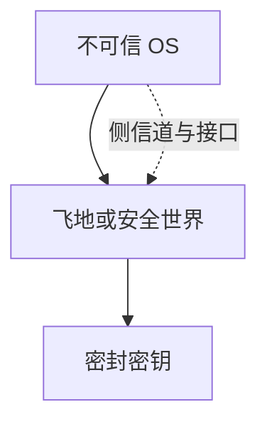

# TEE：SGX / TrustZone

可信执行环境把敏感代码放进与操作系统隔离的飞地。SGX 在进程内划飞地，TrustZone 划安全世界。TCB 变小，但侧信道、接口与供应仍在模型里。

<footer>—— Costan and Devadas, Intel SGX Explained；ARM TrustZone 白皮书；对照[隔离](/cs/isolation-sandbox)</footer>

## 定位

上一课[Kerberos](/cs/windows-kerberos-attacks)的密钥仍可能在 OS 内存。缺口是**对 OS 也不信任时**的盒子。本课对照 SGX 与 TrustZone，不写飞地攻击步骤。

后课默认已经读完本课钉下的合同，只补差，不从该领域第一性原理重开。

## 问题

HSM 是外盒；TEE 是 CPU 里的盒。飞地密封、远程证明（后课）。缺口是：OS 仍调度与供页，侧信道模型要打开。

### 接口

飞地与不可信世界的调用约定是新攻击面，要当协议审。

Costan–Devadas。SGX 的公开研究含侧信道，本课不复现。机密计算下一课把 TEE 收到云产品叙事。

## 方法

对照：TrustZone 安全世界 vs SGX 用户态飞地。指出内存加密引擎的角色。下一课机密计算。

图中节点是本课的机制骨架；课程不把图展开成可运行的攻击步骤。

## 机制

缩小对 OS 的信任。证明下一课让远端相信飞地度量。机密计算把同一思想卖给云租户。

前提写进合同之后，游戏外的误用只当失败模式点名，不在本课写成操作程序。

## 边界

不写飞地利用。机密计算下一课。

## 小结

- 票据密钥怕 OS；TEE 对 OS 隔离敏感码。
- SGX 飞地，TrustZone 安全世界。
- 侧信道与调用约定仍在模型里。
- 下一课机密计算。
- 出处：Costan and Devadas；ARM TrustZone；[isolation-sandbox](/cs/isolation-sandbox)。
