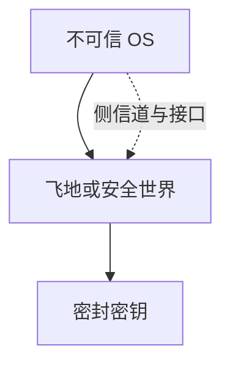

# TEE：SGX / TrustZone

可信执行环境把敏感代码放进与操作系统隔离的飞地。SGX 在进程内划飞地，TrustZone 划安全世界。TCB 变小，但侧信道、接口与供应仍在模型里。

<footer>—— Costan and Devadas, Intel SGX Explained；ARM TrustZone 白皮书；对照[隔离](/cs/isolation-sandbox)</footer>

上一课[Kerberos](/cs/windows-kerberos-attacks)的票据密钥仍躺在 OS 内存里，内核被攻破即全丢。缺口是**对 OS 也不信任时**的盒子。本课对照 SGX 与 TrustZone，不写飞地攻击步骤。

后课默认已经读完本课钉下的合同，只补差，不从该领域第一性原理重开。

## 问题

HSM 是机箱外的盒子，边界清晰但部署重；TEE 把盒子搬进 CPU：SGX 在进程地址空间里划飞地，TrustZone 把整颗芯片分成普通/安全两个世界。飞地可密封数据（绑定芯片与代码度量的加密）、可远程证明（后课）。但「对 OS 零信任」不是零交互：OS 仍负责调度、供页与中断，页换出、TLB 操纵都是侧信道入口——威胁模型必须把侧信道明写进去，否则等于赌敌手只走功能正确的 API。

### 接口

飞地与不可信世界的调用约定是新攻击面：参数怎么传、指针能否指向飞地内、异常如何回卷，每一项都对应一类混淆代理或 TOCTOU 缺陷，要当协议审，不能当函数调用看。

Costan–Devadas。SGX 的公开研究含侧信道，本课不复现。机密计算下一课把 TEE 收到云产品叙事。

## 方法

对照两个粒度：TrustZone 在硬件层分世界，安全世界有自己的内核与外设，粒度粗、迁移成本高；SGX 飞地在用户态进程内，粒度细、存量代码不动，代价是系统调用要出飞地代跳。内存加密引擎的角色要指出：DRAM 上的飞地页被加密并挂完整性树，内存总线探头读到的是密文与校验失败。下一课机密计算。

```mermaid
flowchart TD
  OS["不可信 OS"] --> EE["飞地或安全世界"]
  EE --> SEAL["密封密钥"]
  OS -.->|"侧信道与接口"| EE
```

## 机制

TEE 的本质是把 TCB 从「整个 OS 加 hypervisor」缩到「CPU 微码加飞地代码」：信任面小了几个量级，但没有归零——微码缺陷、封装的加密基元、上面那道调用接口都还在盒子里。远程证明下一课让远端相信飞地的度量值；机密计算把同一思想卖给云租户：你连云厂商运维也不必信，但换成了要信芯片厂。

## 边界

不写飞地利用的具体步骤，不复现已公开的 SGX 侧信道攻击。机密计算下一课。

## 小结

- 票据密钥怕 OS；TEE 对 OS 隔离敏感码。
- SGX 飞地，TrustZone 安全世界。
- 侧信道与调用约定仍在模型里。
- 下一课机密计算。
- 出处：Costan and Devadas；ARM TrustZone；[isolation-sandbox](/cs/isolation-sandbox)。
