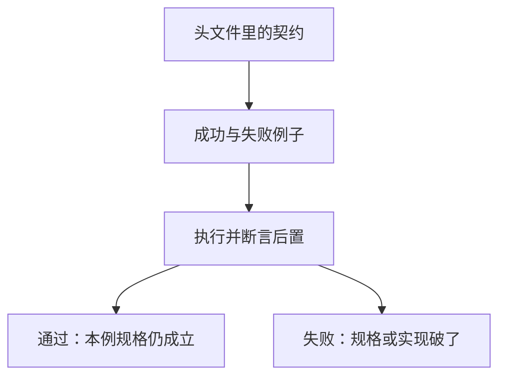

# 测试作为规格

测试把接口契约写成可重复执行的例子：给定输入与前置，断言后置；失败路径与成功路径同等重要。

<footer>—— 据 Kernighan & Ritchie, The C Programming Language, 2nd ed.；ISO/IEC 9899 整理</footer>

上一课[错误码与失败](/cs/error-code-failure)要求失败也有后置条件。本课不重列 `errno`，也不从测试框架产品另起。缺口是：契约写在头文件与注释里仍会被读漏，**怎样让「成功/失败各应当发生什么」在每次改代码后自动核对**。测试是可执行的规格，不是发布前才补的清单。

## 问题

函数边界已经声明所有权与错误码，但声明不会在链接期验证语义。一次重构、一次优化、一次「顺手改返回值」，都可以在类型仍匹配时改掉后置。缺口因此不是 assert 语法，而是**把例子提升为规格**：选定输入（含失败输入），调用，检查返回码、输出对象与资源是否按契约变化。没有失败用例，错误处理课等于没写完。

测试不能证明没有 UB——未定义行为可以在测试机上「通过」。本课承认这个上限：测试覆盖的是可观察的约定行为；UB 仍靠语言规则与 sanitizer。规格与探测器分工，与未定义行为课的结论一致。

### 测试不是调试打印

调试是一次运行里看现场；测试是可重复、可自动、失败时给出哪条契约破了。把 `printf` 留在主干里当「测过了」，既不能在构建里拦截回归，也不能描述失败路径。单元测试针对函数契约；后课构建系统会把它接进每次编译之后的命令。也不要把测试写成对私有静态表内部布局的快照——那会把实现冻死，与「函数可替换」相反。

K&R 用小程序验证函数行为。ISO C 的 `assert` 在关闭时可以消失，不适合当唯一的错误处理。本课不绑定某一种测试框架名字，只钉「例子即规格」。

## 方法

一条测试对应契约里的一条断言：正常输入得到规定输出；空指针或长度为零得到规定错误码且无泄漏；别名允许或禁止的参数组合各测一次。资源类函数还要查失败路径上已申请的块被释放。测试本身是程序，同样遵守寿命与 UB 规则。

测试与实现一同提交，这是下一课版本控制要跟踪的变更的一部分。规格变了，测试必须先改；实现变了而规格未变，测试应红。这个方向不能反：先改实现再「修测试迁就」会把规格默默改掉。

例子要小而硬：给定明确的输入比特与长度，断言返回码与输出缓冲的前 n 个字节，而不是「看起来差不多」。浮点比较要用容差并写明范数，否则数值课那种舍入会让测试在不同机器上闪烁——那是后课的语言，本课先承认规格必须写清比较方式。随机测试能找边界，但失败时要能缩小成固定例子再提交，否则版本历史无法回放。构建把测试挂在链接之后，红即不过。

## 机制

可执行规格把回归从「作者记忆」变成构建产物。它逼迫接口保持可测：隐藏全部状态、只靠全局、不可注入的失败，都会让失败路径写不出来——这往往说明抽象边界还没切好。测试也给出文档：后来者先读例子再读实现。后课封装会把内部不变量也变成断言，但那些断言属于实现，不一定属于对外规格。

失败用例要可重复：不能依赖机器上偶然的 `ENOMEM`，而要注入假的分配失败或用测试替身替换边界函数。这反过来逼接口允许替换——函数指针、链接期包装或编译期宏开关。过度依赖宏会把规格绑到预处理器，后课会警告。测试与 UB 的分工也要写进构建：开 sanitizer 的配置跑同一批例子，绿的是「这些路径上没观测到 UB」，不是全程序证明。版本历史里测试与实现同差，规格才不会在某次「顺手改返回值」时无声漂移。

## 边界

本课不讲覆盖率数字的迷信，不把形式化验证请来。下一课[版本控制与变更](/cs/vcs-changeset)把规格与实现的改动收成一次可回放的变更。后课默认：契约有对应的成功/失败例子；测试不依赖 UB 的一次观测；测试跟接口走，不冻死私有布局。

测试与实现若必须改同一私有布局才能同时绿，说明测的是表示不是契约。把例子写在公开函数上，重构才不会把规格一起改掉。失败信息应指出哪条后置破了，而不是只印 assertion failed。

## 小结

- 测试是可执行契约：输入、前置、后置，含失败路径。
- 通过测试不证明无 UB；那仍是语言与 sanitizer 的事。
- 规格变更先改测试；实现变更而规格不变则测试应拦截。
- 下一课把这些改动收进版本历史。
- 出处：K&R 用小程序验证函数；ISO C `assert` 作为辅助而非错误通道。
