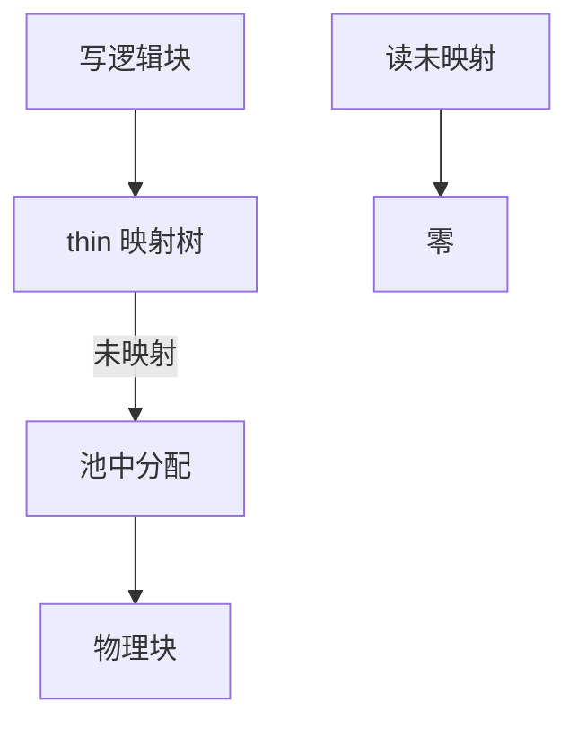

# 精简配置

精简池只在第一次写入时分配后端块；逻辑卷可以声称比池更大，直到真正写满才 ENOSPC。

<footer>—— 据 Linux dm-thin 文档；存储行业对 thin provisioning 的实践整理</footer>

[上一课](/cs/dm-crypt)不改变「逻辑块总对应物理块」。[稀疏文件](/cs/sparse-files) 是 FS 层的洞。设备层也可以：**thin**。缺口是 dm-thin 的池、元数据、以及丢弃如何还块。

## 问题

虚拟机每人一块 100G 盘，实际平均用 10G。厚配置浪费。thin：逻辑设备 + 池；映射树（类似 extent）记录已写块。未映射读：返回零（或未定义，视实现）。写：分配池块，更新元数据（常有独立 metadata 设备）。缺口：池满时哪些卷失败；快照在 thin 上便宜（共享映射）；与 [配额](/cs/fs-quota) 不同——这是块设备会计，不是 uid。

元数据耗尽与数据耗尽是两种满。thin 快照不是 btrfs subvol，但共享物理块的直觉相近。

## 方法

第一次写逻辑块 L：锁元数据，分配 P，写数据到 P，提交映射。读：查映射，无则零页。`discard` 删除映射，还池——[TRIM](/cs/discard-trim) 后课。对照 LVM thick：创建时就切走 PV 空间。对照 FS fallocate：可在 thin 上仍触发分配，视是否传递。

## 机制

精简把超分配从管理承诺变成块层机制，使密度上升，也把「盘满」从创建时挪到运行时——监控变成必修。不要把它写成云计费产品课。与 RAID：thin 可叠在 md 上，池满与成员故障是不同失败。

崩溃：元数据必须日志或 COW，否则映射丢失——dm-thin 有自己的元数据事务。

实现上：元数据设备写满比数据池满更致命：映射无法更新，整池只读或失败。快照共享映射项，删除要延迟到引用为零，监控必须看 metadata 占用。 读法上只引用[上一课](/cs/dm-crypt)的结论，不把对象换成训练推理或限价簿。

本课在操作系统进阶的「存储栈 / 块层到设备」课序里，对象是 **精简配置**。

- 先修只引用，不重导：上一课的结论当公理，本课只补差。
- 五栏不吞并：不把本课写成大模型训练/推理，也不写成限价簿或权重量化。
- 文献用 OSTEP、McKusick、内核文档与具名会议论文；不发明 arXiv 编号。

## 边界

本课不引入 CAS（内容寻址）重删的全部指纹。不保证每个 hypervisor 的 UNMAP 行为。下一课用快速盘给慢盘做缓存：bcache。

版本字段会变，课序钉的是机制对象「精简配置」，不是某一主线内核的结构体名。
后课默认：逻辑盘可超分配，写时占池。块层缓存数据盘，下一课 bcache。

## 小结

- thin 按首次写分配；读洞得零。
- 池与元数据会分别耗尽。
- bcache 是下一课。
- 出处：Linux dm-thin；LVM thin 文档；*OSTEP* 对分配的背景。
