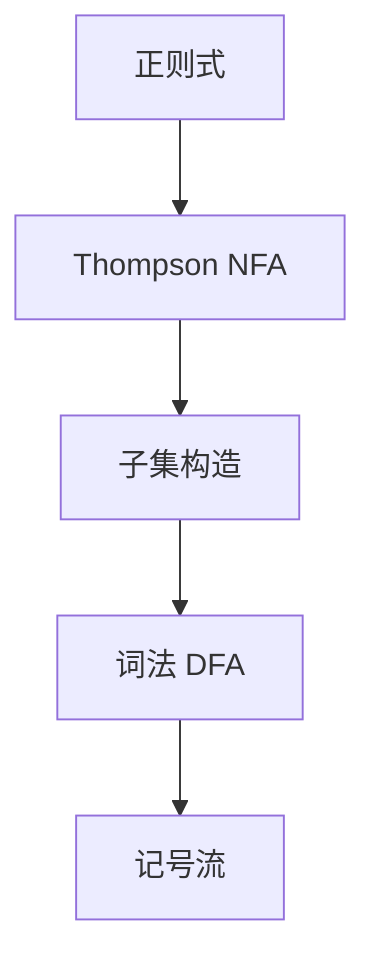

# Thompson 构造

正则的并、连接与星号各对应一小块带 $\varepsilon$ 边的 NFA；结构归纳拼出整式，状态数与式子大小线性。

<footer>—— 据 Thompson, Regular Expression Search Algorithm, 1968；龙书第 3 章整理</footer>

上一课[NFA 与 DFA](/cs/nfa-dfa)给出子集构造，但正则表达式还没有自动机。词法课把「正则 → NFA」写成箭头。本课不重做确定化。缺口是 Thompson：每个子式一块 NFA，一个入口、一个出口，$\varepsilon$ 连接三算子。拼完再确定化，词法器才真正落地。后课嵌套括号超出正则，换成 CFG。

## 问题

正则式 $\varepsilon$、$a$、$E|F$、$EF$、$E^*$ 的语法树要对成机器。Thompson：原子是两态一条标号边（或 $\varepsilon$）。并为两入口 $\varepsilon$ 分叉、两出口 $\varepsilon$ 汇合；连接把前一块出口 $\varepsilon$ 接到后一块入口；星号是绕回加可跳过的 $\varepsilon$。每块恰好一入一出，避免乱接。缺口是这份归纳，不是再定义正则语言。

状态数 $O(|E|)$，边数同样。确定化仍可能指数，但 NFA 本身瘦，适合先构造再子集。McNaughton–Yamada / Glushkov 无 $\varepsilon$ 的另一构造，本课点名，主干用 Thompson。

### $\varepsilon$ 边是拼装胶水

运行期 DFA 不再看见 $\varepsilon$：子集构造时闭包掉。不要在 DFA 上保留 $\varepsilon$。也不要把 Thompson 的出口当接受态之外再挂长链——每块出口即该子式的接受。

Thompson 1968，CACM。龙书 3.7 节图示四块。Hopcroft–Ullman 把正则与 NFA 互译当定理；本课要编译器用的那一方向。

## 方法

递归下降读正则式（或已有的正则 AST），按算子 new 状态、加 $\varepsilon$。全体并成词法大 NFA：新起点 $\varepsilon$ 连到各种别的 Thompson 机，各出口标种别。再子集构造，冲突用最长匹配与规则序——词法课已有，本课不重写。

正确性：对式子结构归纳，块认的语言等于子式。星号的绕回对应 Kleene 闭包。

## 机制

线性大小使生成器可处理人手写的标识符、数字正则。Unicode 字符类会把原子块打肥，不改变归纳。位置（行号）在 DFA 扫描时记，不在 Thompson 态上。

与[KMP](/cs/kmp)：单模式精确串是正则的特例，KMP 不必走 NFA；词法是多记号正则并。

## 边界

本课不匹配括号嵌套。不把最小化证完。后课默认：记号流由正则的 Thompson + DFA 产出。上下文无关文法接下一层嵌套，对象换成产生式，不再是有限自动机。

## 小结

- Thompson 按并、连、星拼 NFA，大小线性于式子。
- 再确定化得到词法 DFA；$\varepsilon$ 在闭包里消失。
- 嵌套结构不是正则，下一课 CFG。
- 出处：Thompson, 1968；Aho et al., 龙书第 3 章。
