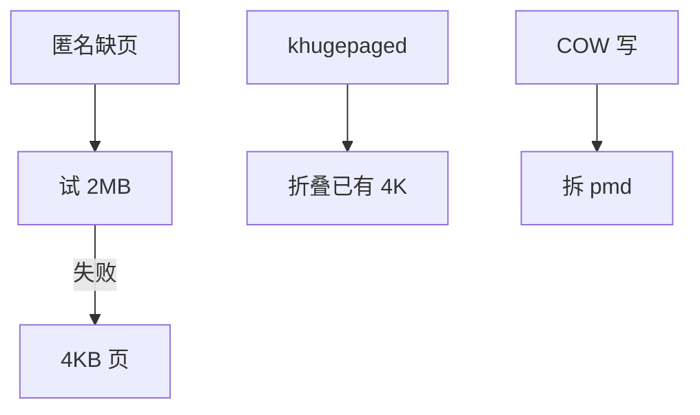

# 透明大页 THP

THP 在匿名（及部分文件）映射上自动用 2MB 页：少页表、少 TLB 失配，失败则拆回 4KB。

<footer>—— 据 Linux transhuge 文档；Navarro 等对超级页的背景；Gorman 对 THP 的整理</footer>

[compaction](/cs/page-migration-compaction) 为的是交出连续 512 个 4K 框。[TLB](/cs/tlb-translate) 主干已说明大页的好处。缺口是 **透明**：应用不 `hugetlbfs` 也能用，以及拆页与延迟。

## 问题

`mmap` 匿名区默认可被 khugepaged 扫描折叠，或缺页时直接分配大页（always/madvise）。缺口：内部碎片（只用 1 字节也占 2MB）；NUMA 跨节点大页更痛；fork COW 要拆或整页拷；与 [rmap](/cs/rmap) ——一条 pmd 映射，反查粒度变粗。本课不把 hugetlb 预留池写成运维手册。

`madvise(MADV_HUGEPAGE)` 是 always 之外的选择。禁用 THP 是数据库常见旋钮，因为延迟尾部。

## 方法

缺页：尝试 `alloc_hugepage`，失败则 4K。khugepaged：找对齐的 4K 序列，compact，安装 pmd。拆：写保护 COW、部分 madvise 或内存紧张。对照 [extent](/cs/ext4-extents)：连续虚存 ↔ 连续物理。对照 DAX：大页映射 PMEM 是另一配置。

## 机制

THP 把 TLB 覆盖范围加大，用碎片与延迟换吞吐。它是透明的，因而错误默认会伤害延迟敏感负载。不要写成 CPU 硬件预取。与 [cgroup](/cs/memcg)：大页占用按 2MB 记账，限制更易触顶。

调试：`/proc/vmstat` 的 thp 计数；拆页失败会泄漏或回退。

实现上：khugepaged 扫描会占用 CPU，桌面发行版常把 defrag 设成 madvise。拆页失败可能留下分裂中的 pmd，要重试。文件 THP 对 tmpfs 有意义，对磁盘 FS 仍受限。 读法上只引用[上一课](/cs/page-migration-compaction)的结论，不把对象换成训练推理或限价簿。

本课在操作系统进阶的「内存进阶 / 回收、迁移与加固」课序里，对象是 **透明大页 THP**。

- 先修只引用，不重导：上一课的结论当公理，本课只补差。
- 五栏不吞并：不把本课写成大模型训练/推理，也不写成限价簿或权重量化。
- 文献用 OSTEP、McKusick、内核文档与具名会议论文；不发明 arXiv 编号。

## 边界

本课不引入 1GB 页的全部引导参数。不保证文件 THP（shmem/tmpfs）在所有版本默认开。下一课另一条「合并物理页」：KSM 按内容。

版本字段会变，课序钉的是机制对象「透明大页 THP」，不是某一主线内核的结构体名。
后课默认：内核可透明使用匿名大页。按内容合并相同页，下一课 KSM。

## 小结

- THP 自动用 2MB，失败或 COW 则拆。
- 换 TLB 效率，付碎片与尾延迟。
- KSM 是下一课。
- 出处：Linux transhuge；Navarro 超级页；Gorman。
