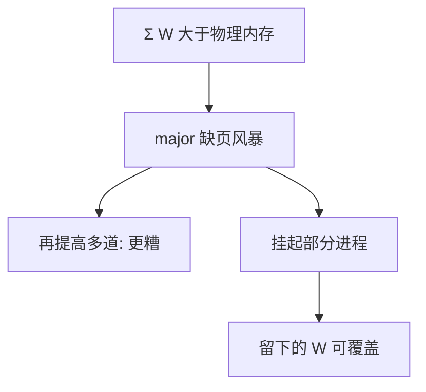

# 抖动

系统把几乎全部时间花在换页上，吞吐接近零；再精致的 CLOCK 也救不了工作集之和大于内存。

<footer>—— 据 Denning 对抖动的讨论；Silberschatz et al., Operating System Concepts 整理</footer>

[上一课](/cs/working-set)要求驻留集盖住 W(t, Δ)。物理帧是固定的。多道一高，每个进程的窗口都装不下。[调度指标](/cs/scheduling-metrics)上 CPU 利用率可能看起来不低——核在跑缺页处理与 I/O 等待。缺口是**诊断与负荷控制**：认出抖动，并减少同时驻留的工作集个数，而不是把时间片切得更碎。

## 问题

置换课已警告「工作集大于内存则任何算法都会抖」。本课要回答：抖和不抖在计数器上差在哪，内核可以采取什么。缺页率高、交换设备饱和、就绪队列却空（都在等页），是典型画像。若误判为 CPU 不够而再多塞几个作业，W 之和更大。缺口不是新的页表位，而是负荷：挂起若干进程，把它们的帧交给剩下的，使留下的集合可覆盖。

本课不把 LIFO 挂起策略的全部变体写完。

中等程度的多道有一个峰值：太少则 CPU 闲，太多则抖动。工作集模型给峰值一个解释，而不是一条可移植的魔法数字。

## 方法

监测 major 缺页与交换吞吐。超过阈值：停止接受新作业，或换出（挂起）整个进程的驻留集。恢复时按工作集再调入，避免一次只换一页地爬。PFF 若持续高，减该进程帧数会更糟，应减进程数。与实时调度对照：期限任务若因换页错过，先保证其工作集钉住，而不是提高优先级空转。

## 机制

抖动说明虚存不是无限 DRAM：它把磁盘当成 Cache 的下一层，缺失代价以毫秒计。CLOCK 只决定「哪一页走」；抖动决定「有没有哪一页走了还能工作」。[局部性](/cs/locality-principle)一旦被换页打散，引用串不再有稳定窗口。用户看见的是全机卡死，不是某一个 malloc 返回 NULL——匿名页稍后还有 OOM，本课先钉负荷。

不要把抖动写成网络安全或攻击；它是资源规划失败。

## 边界

本课不引入 cgroup 的内存上限全文（隔离课会回来）。不把网络交换（远程页）当默认。SSD 降低了换页延迟，阈值会变，结构不变：ΣW > RAM 仍抖。文件页与匿名页谁先被扔，下一课才分来源——扔掉文件页可能只是再读文件，不一定是抖动。

后课默认：负荷控制针对「页」的总量。页从哪来、扔掉是否必须写交换区，下一课匿名页对文件页。

## 小结

- 抖动是 ΣW 超过内存；对策是减多道，不是更小时间片。
- 画像：高缺页、交换饱和、CPU 在等 I/O。
- 页的后备设备不同，淘汰代价不同，是下一课。
- 出处：Denning；Silberschatz et al., *OSC*；Tanenbaum *MOS*。
