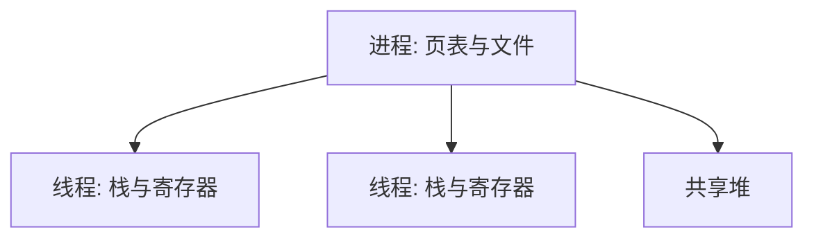

# 线程与共享地址空间

线程是进程内部的一条控制流；同一进程的线程共享地址空间，各有各的栈与寄存器。

<footer>—— 据 Silberschatz et al., Operating System Concepts；Birrell, An Introduction to Programming with Threads 整理</footer>

[上一课](/cs/process-groups)让一份映像对应一份地址空间、一条执行流。缺口是：服务器与运行时往往要在**同一份用户页**里同时算多件事——若每件事都 fork 一份进程，页表、文件表都复制，太重。本课只把线程定义为共享地址空间的执行流。

## 问题

进程切换要换页表根，[TLB](/cs/tlb-translate) 开销大；进程间通信还要走后课的管道。同一程序里的请求处理、GC 与计算，本来就该看见同一堆。缺口不是新的虚存硬件，而是在一个 PCB 下挂多套寄存器与栈，代码段、数据段、打开文件默认共享。

本课不讲如何互斥地改这份共享堆，那是竞争与锁的课。这里只钉共享与私有各是什么。

POSIX 线程是用户可见的接口。内核线程与用户级线程的映射（1:1、N:1）是实现，主干先按「内核可调度的一条控制流」理解。

## 方法

每个线程：私有寄存器、私有用户栈、私有线程局部存储；共享：页表、堆、全局数据、文件描述符表。创建线程不复制地址空间，只分配栈与线程控制块。进程退出则其中所有线程一起结束。

用户级线程库可以在一个内核线程上自己切换栈，内核看不见；本课后头的调度默认调度内核线程。两种实现的细节不展开。

## 机制

共享地址空间让指针可以直接递给「另一个执行流」，无需序列化。代价是：栈溢出、野指针会破坏所有线程的堆。内核仍然按线程选谁上 CPU；页表根在同进程线程之间通常不变，切换比跨进程便宜。

运行时 GC 扫描的是进程堆，必须看见所有线程的根（寄存器与栈）。上一课的 GC 直觉在这里变成：根是每条线程一份，堆是一份。本课不写扫描算法。

## 边界

本课不引入协程与绿色线程的全部语义，不把 GPU 线程束请进来，也不讲数据竞争的形式定义——下一课才把「同时写同一地址」收成临界区。fork 之后线程数如何收口，Unix 有明确规定，主干不背手册。

errno 与浮点环境是否线程局部，属于 ABI；主干只要求寄存器与栈私有。

后课默认：同进程线程共享用户地址空间，各有栈与寄存器。内核如何把 CPU 从一条线程挪到另一条，下一课讲上下文切换。

## 小结

- 线程是共享地址空间的控制流；私有的是栈与寄存器。
- 同进程切换通常不换页表根，比换进程轻。
- 共享堆上的互斥仍未给出。
- 出处：Silberschatz et al., *OSC*；Birrell, *An Introduction to Programming with Threads*, 1989。
