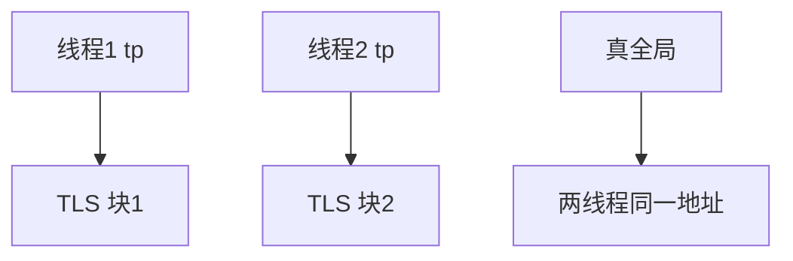

# 线程局部存储

同一符号在每个线程里对应不同的内存：栈是一份，TLS 把「看起来像全局量」的东西也变成每线程一份。

<footer>—— 据 Drepper, ELF Handling For Thread-Local Storage；Silberschatz et al. 整理</footer>

[上一课](/cs/ult-klt)把可调度对象钉成内核线程。共享地址空间里，全局变量默认**所有线程看见同一份**。[线程](/cs/thread-shared-addr)已说栈与寄存器私有。缺口是：`errno`、运行时的当前对象、编译器的 `__thread` 变量既不是栈上的自动量，也不能放进真全局——那叫**线程局部存储（TLS）**。本课只钉模型，不写动态链接器的全部 TLS 模板。

## 问题

C 库把错误码放在 `errno`。若它是普通全局，两条线程的系统调用会互相覆盖错误。若每次数组按 tid 查找，又慢又要锁。硬件提供线程指针寄存器（或 `fs`/`tp`）：内核在切换时把它写成该线程 TLS 块的基址，用户用固定偏移访问。缺口不是新的 1:1 映射，而是这份**每线程一块的数据段**。

TLS 仍在该进程的页表里，只是每条线程的基址不同。别的线程若拿到指针，仍能读你的 TLS——私有是约定，不是硬件隔离。

## 方法

创建线程：分配 TLS 块，拷贝初始镜像（`.tdata`/`.tbss`），把硬件线程指针写入 PCB，切换时随寄存器恢复。静态 TLS 在加载时布局；动态加载的模块可能走慢路径分配。内核自己的 per-CPU 不是 TLS：一个是按 CPU，一个是按线程。

fork：POSIX 只保留调用线程，其 TLS 随地址空间复制语义走；其它线程的 TLS 丢掉。本课不展开 cow 细节。

## 机制

TLS 让「看起来像全局」的 ABI 在多线程下仍正确。它不提供互斥：两个线程的 TLS 不相干，但指向同一堆对象的指针仍要锁。与[上下文切换](/cs/context-switch)的关系：漏存 `tp` 等于下一线程用错 errno 块。用户级线程库若在一条 KLT 上切 ULT，必须自己改 TLS 基址，否则库内「当前」会串。

## 边界

本课不把 Windows TEB 与 ELF TLS 的格式差异写完，不讨论如何用 TLS 做隐蔽存储。安全隔离不靠 TLS。也不把 GPU 的 private memory 混进来。

后课默认：每 KLT 有 TLS 基址。创建时哪些资源共享、哪些复制，Unix 用 `clone` 的位来选，下一课讲 clone 标志。

## 小结

- TLS：每线程一块数据，硬件线程指针指向它。
- 不是隔离：指针仍可跨线程传递。
- 共享哪些内核对象由 clone 标志决定，下一课。
- 出处：Drepper, *ELF TLS*；Silberschatz et al., *OSC*。
