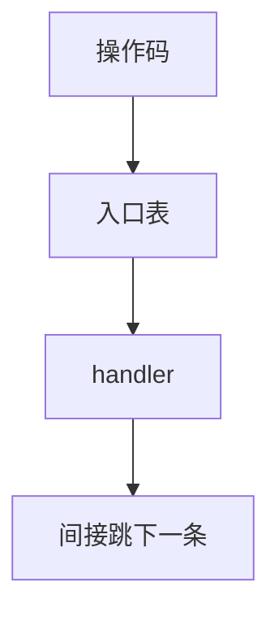

# 线程化分派

把下一条字节码的处理地址直接写进流：间接跳转到该地址，而不是每次回到中央 `switch`。减少分派的间接预测失败。

<footer>—— 据 Ertl and Gregg, The Structure and Performance of Efficient Interpreters；Bell, Threaded Code, 1973 整理</footer>

上一课[栈式对寄存器式](/cs/stack-vs-register-vm) 选了编码。缺口是**分派**：`switch` 每个 case 后跳回循环头，分支预测惨。线程化：computed goto（GCC 标签作值），每条 handler 末尾 `goto *pc++`。本课钉 indirect threading / direct / context threading，不写 JIT。

## 问题

解释器热路径是分派，不是加法本身。线程化把「取下一条入口」变成间接跳。缺口是**控制流形状**，不是操作数编码。

直接线程：指令流就是地址数组。间接：操作码仍是字节，经表变地址。Token threaded：折中。

### 线程化不是操作系统线程

名字来自「用地址串起来」。与 pthread 无关。不要混。

Bell 1973。Ertl–Gregg。Forth 传统。C 的 `goto *` 是 GNU 扩展，可移植要用跳表。

## 方法

实现：`void* table[256]`；handler 末 `goto *table[*pc++]`。超级指令：把高频对（load+add）合成一 handler，减分派次数——与[内联](/cs/inlining-heuristics) 同思想在解释器里。

与 PGO：按轮廓选超级指令。与 JIT：热点仍编译，冷路径留线程化解释。

## 机制

间接跳仍难预测，但比「都跳回同一 switch」好。代码体积：handler 复制。调试：PC 仍要可映射源。

不要在 handler 里调用会改变栈对齐的未知函数而不保存 VM 状态。

## 边界

本课不写方法 JIT。后课默认：高效解释器用线程化分派。下一课方法 JIT 与热点。

也不把线程化当 GPU warp。

## 小结

- 线程化：handler 末间接跳，去掉中央 switch。
- 超级指令减分派。
- 仍是解释器，不是 native 编译。
- 出处：Bell, 1973；Ertl and Gregg。
