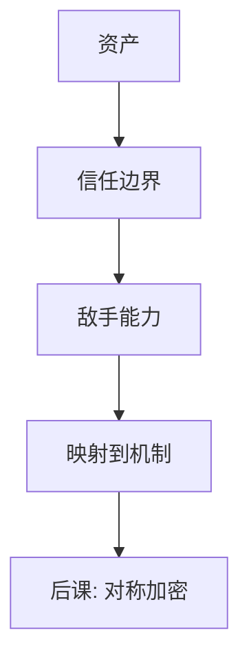

# 威胁模型

先写清谁能看、谁能改、谁能停，再选机制；没有敌手的「安全」只是口号。

<footer>—— 据 Anderson, Security Engineering；Shostack 对威胁建模的整理</footer>

[上一课](/cs/cia-triad)钉死三轴。本课不重定义保密。缺口是：三轴要对**哪一类敌手**成立。能窃听链路的人，与能跑同机进程的人，与能改 DNS 的人，不是同一场考试。后课每一种密码与隔离，都默认你已经会说「不防谁」。

## 问题

CIA 没有量化对象：无界全能敌手下没有可用系统。缺口不是列举攻击名称，而是画一张图：资产、入口、信任边界、敌手能力（被动窃听、主动改包、恶意端点、物理接触）。[TLS 入口](/cs/http-tls-entry)防的是链路上的被动者加部分主动者，不防已攻破的浏览器。OS 隔离防的是用户态越权，不防同用户的漏洞代码。

本课不引入 STRIDE 的商标式背诵，只用「伪造、篡改、否认、信息泄露、拒绝服务、越权」当检查清单。

Kerckhoffs：系统的安全性应落在密钥保密，而不是算法隐瞒。威胁模型里「敌手知道算法」是默认，不是悲观。

## 方法

写清：要保护的资产（密钥、库中元组、签名私钥）；敌手在边界外还是内；失败时优先保哪一轴。然后才映射到后课机制。假设崩溃的 2PC 与假设拜占庭的共识不是同一模型——本栏不把拜占庭共识插入主干，只标明 2PC 不在那一模型里。

## 机制

同一机制在不同模型下结论相反。加密在「只能看链路」下给保密；在「能看内存」下不够。完整性在「能改包」下要 MAC；在「能拿签名私钥」下要撤销与旋转。把模型写进设计，后课才不会把 TLS 当成「整机安全」。

## 边界

威胁模型会过时：侧信道把「看不到内存」改成「能测时间」。本课承认模型是假设，不是物理定律。也不把渗透清单当模型：清单是测试，模型是规格。

信任边界画错（把同一主机上的进程当成外部敌手或相反）会让后课沙箱与 TLS 的分工错位。后课默认：谈到采用某种密码，先有敌手能力；对称加密服务的是共享密钥已安全分发的那一类场景。

写不清「不防谁」，后课公钥与沙箱都会被误读成全能。模型宁可窄而真，不要宽而假。

## 小结
- Kerckhoffs：敌手知道算法，秘密在密钥与边界。
- 后课对称加密只服务「能看密文、没有密钥」这一档。

- CIA 是轴；本课补敌手、边界、资产。
- 算法公开、密钥保密是默认假设。
- 共享密钥下的保密机制，下一课才讲。
- 出处：Anderson, *Security Engineering*；Kerckhoffs, 1883。
