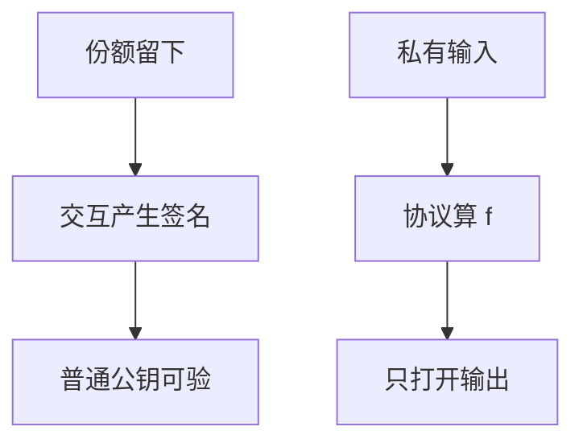

# 门限签名与 MPC 直觉

门限签名让 $t$ 方一起签发，任何一方拿不到完整私钥。安全多方计算把「一起算 $f$」当成协议目标，中间值按共享走，输出才打开。

<footer>—— 据 Yao 百万富翁问题；Goldreich, Micali and Wigderson；对照 Boneh, Lynn and Shacham 对门限的后续工程</footer>

## 定位

上一课[Shamir](/cs/shamir-secret-sharing)重构后秘密又聚回一点。缺口是**计算阶段也不聚合明文**。本课直觉：门限 ECDSA/EdDSA 与 MPC 的诚实多数/恶意模型，不写可部署的协议抄本。

后课默认已经读完本课钉下的合同，只补差，不从该领域第一性原理重开。

## 问题

HSM 是单盒；组织要「五人中三人签字」。门限：KeyGen 分布式，Sign 交互，Verify 仍用普通公钥。MPC：各方输入保密，只揭示 $f(x_1,\ldots)$。缺口是目标陈述与敌手模型，不是电路乱码的实现作业。

### 中止与公平

恶意敌手可让协议中止。公平性（要么都得输出要么都不得）更贵。工程上常退让。

Yao；GMW。DKLS 等门限 ECDSA 是工程文献，本课不点具体利用。后课同态是另一条「算密文」的路。

## 方法

对比三种：重构再签（弱）、门限签（私钥永不出现）、通用 MPC。写诚实多数 vs 恶意、带广播 vs 点对点。指出 nonce 在门限 ECDSA 里仍危险，EdDSA/Schnorr 更贴线性。

图中节点是本课的机制骨架；课程不把图展开成可运行的攻击步骤。

## 机制

最小特权：单人无法签。这服务治理，不服务「防所有侧信道」——交互本身有时序。网络异步下要小心同步假设。同态加密下一课把计算丢给持密文的一方，交互模式不同。

前提写进合同之后，游戏外的误用只当失败模式点名，不在本课写成操作程序。

## 边界

本课不提供门限 nonce 复用的攻击步骤。同态直觉下一课：密文上加乘，解密才见结果。

## 小结

- 共享若重构再签，秘密又单点化。
- 门限签名：交互产出，公钥仍单把。
- MPC 把任意 $f$ 当协议；模型要写清恶意与中止。
- 下一课：同态加密直觉。
- 出处：Yao；Goldreich, Micali and Wigderson；Shamir, 1979。
