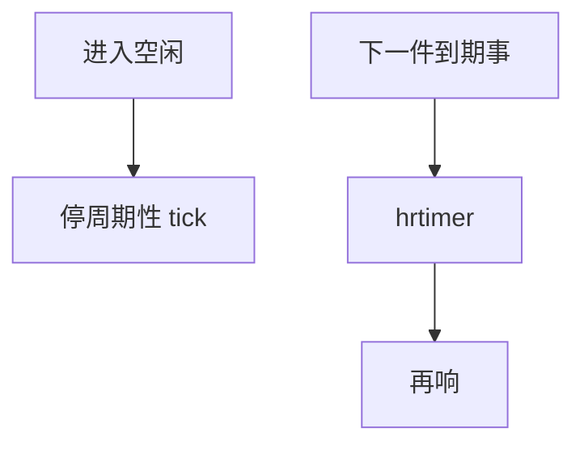

# tickless

NO_HZ 在核空闲（或甚至有任务但动态）时关掉周期性调度 tick，用 hrtimer 在真正需要时再响，让 C-state 能睡稳。

<footer>—— 据 Linux timers/NO_HZ 文档；Corbet 对 tickless 的 LWN 整理</footer>

[cpuidle](/cs/cpuidle-cstate) 被周期性 tick 吵醒就进不了深 C。[EEVDF](/cs/eevdf) 仍要记账。缺口是 **tickless**：idle 与 full dynticks 的差别。

## 问题

传统 HZ 次/秒中断，空闲也响。`NO_HZ_IDLE`：空闲停 tick。`NO_HZ_FULL`：隔离核上单任务也可停，给 HPC/RT。缺口：时间会计靠进入/退出补；POSIX CPU 时钟变粗；RCU 回调要有核处理。本课不把所有 nohz 限制列出。

隔离核仍要偶尔处理 IPIs。对象是时钟中断策略，不是用户 crontab。

## 方法

idle 入口：取消 tick，设下一个需要的 hrtimer。busy nohz full：把该 CPU 移出常规 tick 掩码。对照 [NAPI](/cs/napi)：包 IRQ 仍在。对照 cyclictest：tick 本身是抖动源。对照 [KPTI](/cs/kpti-os)：无关页表。

## 机制

tickless 把「OS 心跳」从固定频率变成事件驱动，服务功耗与隔离核确定性。记账与 RCU 是税。不要写成取消调度。与 [fairness](/cs/fairness-metrics)：无 tick 时份额靠其它更新点。

full nohz 配置错误会导致时间不准或 RCU stall。

实现上：full nohz 要求该 CPU 上几乎只有一个任务，RCU 回调要有人代跑。POSIX CPU 时钟会计变粗。隔离后仍可能被 IPI 和定时器打醒。 读法上只引用[上一课](/cs/cpuidle-cstate)的结论，不把对象换成训练推理或限价簿。

本课在操作系统进阶的「调度进阶 / 公平、实时与能耗」课序里，对象是 **tickless**。

- 先修只引用，不重导：上一课的结论当公理，本课只补差。
- 五栏不吞并：不把本课写成大模型训练/推理，也不写成限价簿或权重量化。
- 文献用 OSTEP、McKusick、内核文档与具名会议论文；不发明 arXiv 编号。

## 边界

本课不引入 xen 偷 tick 的全部。不保证虚拟化 guest 的 nohz。调度课序收口于定时器实现：timer wheel。

版本字段会变，课序钉的是机制对象「tickless」，不是某一主线内核的结构体名。
后课默认：空闲可停 HZ tick。内核如何组织大量定时器，下一课定时器轮。

## 小结

- NO_HZ 停周期性 tick，改用 hrtimer。
- full nohz 服务隔离核，约束多。
- 定时器轮是下一课。
- 出处：Linux NO_HZ；LWN tickless。
