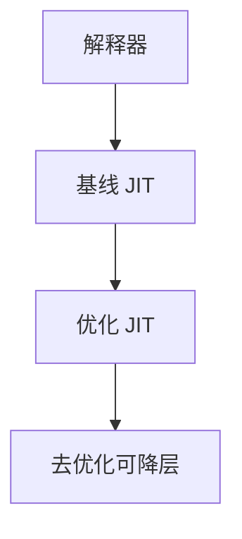

# 分层编译

第一层快而笨（解释器或基线 JIT），高层慢而狠（优化 JIT）。热点升层，冷代码不付顶级编译的代价。

<footer>—— 据 Paleczny, Vick and Click, The Java HotSpot Server Compiler；HotSpot 分层编译说明整理</footer>

上一课[类型反馈](/cs/type-feedback) 在各层都可收集。缺口是**多层**：解释器 / C1 / C2（HotSpot 名）。基线：几乎不优化，生成快，插满 profile。C2：内联、逃逸、循环，贵。本课钉升层策略，JIT 逃逸下一课。

## 问题

只用 C2：启动慢。只用解释器：峰值差。分层：阈值 1 进 C1，更高进 C2。去优化可降回 C1。缺口是**编译预算队列**，不是单层方法 JIT。

代码缓存：高层码更大，挤掉冷码。

### 层不是「CPU 特权环」

Ring 0 是硬件；compilation tier 是 VM 策略。不要混。

HotSpot 论文与博客。Graal 作为另一顶层点名。本课策略，不写 C2 所有遍。

## 方法

每层入口、OSR 入口。计数跨层继承或再收集。后台编译：应用继续在旧层跑，完成后原子换入口。

与 PGO AOT：Graal Native Image 等把顶层提前，启动快峰值固定——点名对照，本课以在线分层为主。

## 机制

栈上有混合帧：C2 调 C1 调解释器。deopt 要认各层映射。不要死锁：编译线程要内存，应用线程要 CPU。

启发：平凡方法永不升 C2。

## 边界

本课不写逃逸算法。后课默认：VM 用分层摊还。下一课 JIT 中的逃逸分析：顶层优化之一。

也不把分层当微服务分层。

## 小结

- 分层：快编译与狠优化分成多层，按热度升。
- 去优化可降层；代码缓存有限。
- 反馈在低层收集供给高层。
- 出处：Paleczny, Vick and Click；HotSpot 分层文档。
