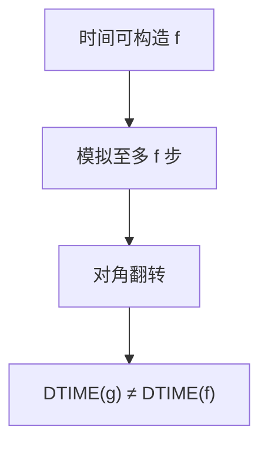

# 时间层级定理

多给一点时间，就能判定严格更多的语言：对角化相对时钟仍然有效，只要函数时间可构造。

<footer>—— 据 Hartmanis and Stearns, On the Computational Complexity of Algorithms, 1965；Sipser 整理</footer>

上一课[组合子与不动点](/cs/combinators-fixed-point)收束可计算性，从未数过步。[P 与 NP](/cs/p-vs-np) 在算法课命名了多项式圈子，但没有证明「更多时间真的更多」。缺口是**时间层级**：对时间可构造的 $f$，$g(n)=o(f(n)/\log f(n))$（单带细节以教材为准）时 $\mathrm{DTIME}(g)\subsetneq\mathrm{DTIME}(f)$。

## 问题

可计算性里对角化不看步数。加上时钟：通用机模拟 $M$ 至多 $f(|x|)$ 步，超时则拒绝，并翻转 $M$ 对自己编码的答案。只要模拟开销小于 $f$ 相对 $g$ 的空隙，新语言在 $\mathrm{DTIME}(f)$ 不在 $\mathrm{DTIME}(g)$。时间可构造：$f(|x|)$ 可在 $O(f)$ 步内在带上写下 $f$ 个记号，否则时钟本身作弊。

于是 $P\subsetneq\mathrm{EXP}$ 等严格包含有着落。$P$ 对 $\mathrm{NP}$ 的包含是否真，层级管不到——那是同一量级内部。

### 不是「指数一定更强」的口号

必须固定模型（多带 vs 单带，对数因子不同）。必须 $f$ 可构造：不可构造的怪函数可以塌缩。层级给的是无穷多层，不是 $P$ vs $NP$。

Hartmanis–Stearns 1965 开创复杂度。Sipser 第 9 章写确定性时间层级。空间层级更干净（无 $\log$ 因子），下一课空间。

## 方法

陈述：多带 TM 上 $\mathrm{DTIME}(n^k)\subsetneq\mathrm{DTIME}(n^{k+1})$ 一类。证明想法：模拟 + 翻转 + 超时。不要具体算通用机的每一步常数。对照：停机问题不可判定，层级语言都可判定，只是慢。

主干渐近记号已有；这里 $O$ 的对象是 TM 步数，输入长度 $|x|$。

## 机制

有了严格层级，才能说「指数时间里有可判定但假定不在 P 的语言」而不只是停机。NPC 完全问题若在 P 则整层塌到 P，与层级不矛盾：层级比较的是不同阶的函数，不是 NP 内部。

非确定时间层级也存在（更精细），本课不写。

空间层级几乎没有 $\log$ 因子，因为可以精确数格子；时间模拟要扫带，空隙必须更宽。间隙定理表明：若 $f$ 不可构造，可能 $\mathrm{DTIME}(f)=\mathrm{DTIME}(2^f)$。课堂函数 $n^k,2^n$ 都可构造。$P\subsetneq\mathrm{EXP}$ 是本课最常用的推论，仍不碰到 $NP$。

## 边界

本课不证间隙定理（怪 $f$ 使 $\mathrm{DTIME}(f)=\mathrm{DTIME}(2^f)$ 一类），不引入相对论化。后课默认：更多（可构造）时间 $\Rightarrow$ 严格更多语言。下一课空间：PSPACE 与 Savitch。

层级比较的是不同阶的可构造函数，不是 NP 内部。因此 $P\subsetneq\mathrm{EXP}$ 与 $P\stackrel{?}{=}NP$ 可以同时成立。后课空间层级更干净，Savitch 再把非确定空间平方掉。

## 小结

- 时间可构造前提下，确定性时间类严格递增。
- 手段仍是对角化，加上时钟。
- 不解决 $P$ 对 $NP$；只分开不同阶。
- 出处：Hartmanis and Stearns, 1965；Sipser。
