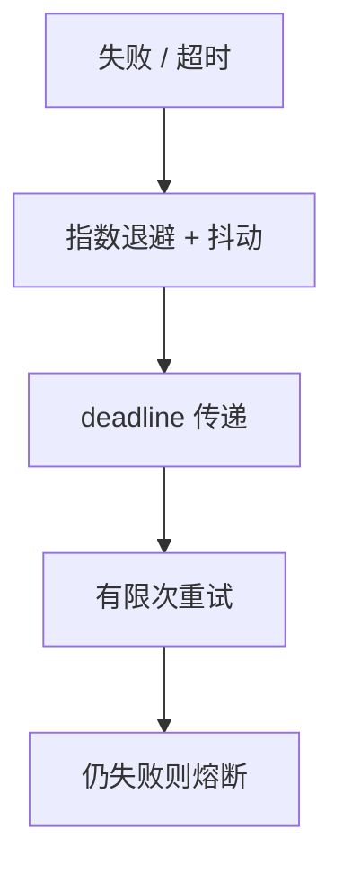

# 超时与退避

超时把「不知道」变成失败。退避让重试错开。没有抖动的同步重试是分布式的惊群，比第一次故障更大。

<footer>—— 据 Ethernet 的截断二进制指数退避；Dean and Barroso 对重试放大的讨论；Google SRE 实践整理</footer>

上一课[熔断](/cs/rate-limit-circuit-breaker)在错误率高时关门。缺口是**门关上之前与半开时**：每次失败立刻重试，下游刚病就被同一波请求再打。本课钉超时选择与指数退避加抖动。后课对冲请求是另一类「同一调用多份」，会再放大。

## 问题

超时太长：线程与连接被占，尾延迟变过载。超时太短：慢成功被当失败再重试，执行次数上升，接到[RPC 语义](/cs/rpc-semantics)。分层超时必须递减：网关 > 服务 > 下游，否则下层还在跑上层已重试。

退避：第 $k$ 次等 $\min(cap, b^k)$ 再加随机抖动。无抖动：所有客户端用同一时钟对齐重试——雪崩。Ethernet 很早就用随机退避拆冲突；RPC 重试是同一形状。

SRE 书强调限制重试预算（retry budget），防止一小撮失败客户端吃光下游。这是限流在时间维。

## 方法

单调钟量超时，接[物理时钟](/cs/clock-drift)。幂等才重试非幂等写。重试预算：一段窗口内重试占比上限。给下游传 deadline，而不是各层各猜。

不要在熔断打开时还按原预算重试。

## 机制

重试放大：失败率 $p$ 时若立即重试一次，负载约 $1+p$，已病系统 $p$ 上升，正反馈。退避与预算把反馈压住。与[故障检测器](/cs/failure-detectors)：超时即怀疑，误伤代价是多余重试，不是脑裂（除非重试的是选主）。

本课不写 TCP RTO 公式全文。也不把无线 CSMA 当数据中心 RPC 的实现。

Deadline 传播：剩余时间随 RPC 走，避免「上层 1s、下层 5s」的倒置。这是部分同步里把 $\Delta$ 写成请求字段。

## 边界

本课不对冲请求（下一课）。不引入自适应超时的全部估计器（点名：Hedged、percentile）。后课默认：重试必抖动必预算必幂等；超时用单调钟与递减 deadline。尾延迟对冲会故意发第二份，必须算进预算。

失败后立刻同步重试是把检测器的误伤变成过载。随机化是活性工程，也是安全负载。

## 小结

- 超时定义「不知道」；太短制造假失败与重复执行。
- 指数退避必须加抖动；要有重试预算。
- Deadline 向下传递，层间递减。
- 出处：指数退避；Dean–Barroso；SRE 实践。
