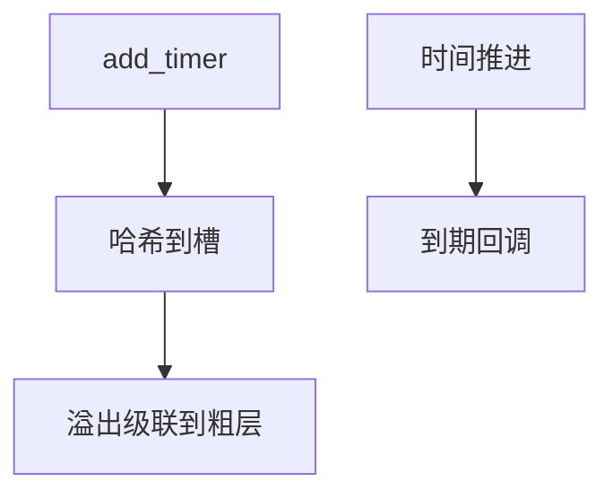

# 定时器轮

timer wheel 用分层环把超时时间哈希到槽：O(1) 插入/删除，到期精度与槽宽成反比，适合海量不精确超时。

<footer>—— 据 Varghese and Lauck 对 hashed timing wheels 的经典论述；Linux timer wheel 文档</footer>

[tickless](/cs/tickless-nohz) 减少了谁来推轮。[TCP](/cs/kernel-tcp-impl) 的 RTO、[NAPI](/cs/napi) 无关但网络栈大量用超时。缺口是 **内核定时器轮** vs hrtimer 红黑树。调度进阶在此收口。

## 问题

百万连接不能每人一棵精确树。wheel：时间模槽数，级联到更粗层。缺口：向前推进可能 cascade 成本；不适合亚微秒；hrtimer 给高精度（DL、nanosleep）。本课不把 cascade 代码写成作业。

jiffies 是轮的经典单位。NO_HZ 下推进发生在必要时。对象是超时集合，不是 RTC 芯片。

## 方法

`add_timer`：算槽，挂链表。tick/hrtimer 回调：处理当前槽，cascade。对照 qdisc：一个按包整形，一个按时间触发函数。对照 [slab](/cs/slab-allocator)：都是内核基础设施。对照用户 timerfd：底层仍可能是 hrtimer。

## 机制

wheel 用精度换规模，使 TCP、邻项、工作队列能活。高精度路径走 hrtimer，避免污染轮。不要写成编译器哈希课。与 [PREEMPT_RT](/cs/preempt-rt)：回调上下文是否可睡决定用哪种定时器。

错误的长时间 cascade 会造成延迟尖峰，这是测量时要看到的。

实现上：cascade 在跨过粗层边界时可能一次处理很多定时器，造成延迟尖峰。hrtimer 走红黑树，给 nanosleep 和 DL。NO_HZ 下轮子在进入空闲时才推到「现在」。 读法上只引用[上一课](/cs/tickless-nohz)的结论，不把对象换成训练推理或限价簿。

本课在操作系统进阶的「调度进阶 / 公平、实时与能耗」课序里，对象是 **定时器轮**。

- 先修只引用，不重导：上一课的结论当公理，本课只补差。
- 五栏不吞并：不把本课写成大模型训练/推理，也不写成限价簿或权重量化。
- 文献用 OSTEP、McKusick、内核文档与具名会议论文；不发明 arXiv 编号。

## 边界

本课不引入 alarmtimer 的全部时钟基础。不保证用户 POSIX 定时器精度等于 wheel。下一单元安全与启动：Linux capabilities。

版本字段会变，课序钉的是机制对象「定时器轮」，不是某一主线内核的结构体名。
后课默认：海量超时走 timer wheel，精确事件走 hrtimer。进程权能如何切分 root，下一课 capabilities。

## 小结

- timer wheel：O(1) 粗粒度超时。
- hrtimer 服务高精度；tickless 改变谁推轮。
- capabilities 是下一单元。
- 出处：Varghese and Lauck；Linux timers。
