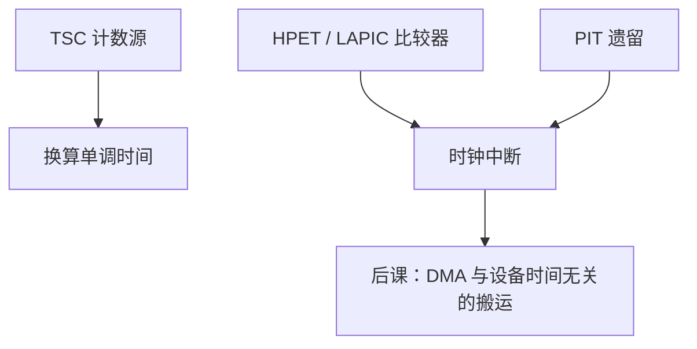

# 定时器：PIT / HPET / TSC

  
调度与超时需要时钟源：8253 PIT 是历史滴答，HPET 是平台计数器，TSC 是核上循环计数；谁稳定、谁可同步，决定时间接口怎么接。

  <footer>—— 据 Intel 64 and IA-32 Architectures Software Developer’s Manual；IA-PC HPET Specification；Patterson and Hennessy, Computer Organization and Design 整理</footer>

[上一课](/cs/apic-interrupt-routing)指出本地 APIC 自带定时器。缺口是平台上**多种时间源**并存：PIT、HPET、ACPI PM、APIC timer、TSC，操作系统如何选时钟事件与时钟源，而不把它们当成同一根线。

## 问题

PIT（8253/8254）：ISA 时代周期滴答，今日遗留。HPET：内存映射比较器，可多路独立中断。TSC：`rdtsc` 读核内计数器，频率曾随休眠变，后来 invariant TSC 承诺恒定。缺口不是 APIC 路由，而是：**事件（一次性中断）与源（单调计数）** 分离。调度器用事件；时间戳用源。

校准：用已知 HPET/PIT 间隔量 TSC 频率。跨核 TSC 是否同步是平台属性，VDSO 时钟要小心。

### TSC 不是「墙钟」

墙钟会 NTP 步进；TSC 是单调（在 invariant 前提下）循环计数，换算成纳秒要乘标定因子。把 `rdtsc` 当 UTC，文件时间戳会错。休眠停核时，非 invariant TSC 会跳，计时器回退是经典 bug。

Intel SDM 描述 TSC 与 APIC timer。HPET 规范描述比较器。Patterson/Hennessy 有设备定时器教学。RISC-V 有 `mtime`/`mtimecmp`（CLINT），对照同一分裂：计数 vs 比较。

## 方法

启动：枚举 HPET、校准 TSC、选 clocksource（TSC 优先若稳定）、选 clockevent（LAPIC 一次性或 HPET）。高精度休眠用单次比较中断，而不是 1000 Hz 节拍——tickless。虚拟化：TSC 偏移与缩放点名。

与[复位](/cs/reset-strategy)后：定时器要重新编程；TSC 在复位后从 0 或保持依平台。

## 机制

下一课 DMA 不依赖这些定时器来搬数据，但驱动超时用它们。固件课的引导计时也用 PIT/HPET 早期，因 TSC 标定尚未完成。本课把「时间」从 APIC 单元里拆出来讲清。

## 边界

本课不写 NTP 算法，不把 PTP 网卡时钟当必修。不讨论 CPU 频率调节对非 invariant TSC 的全部历史。不进入金融交易所时钟同步。

后课默认：TSC 适合快时间戳；中断用 LAPIC/HPET 比较器；PIT 是遗留。

## 小结

- 时钟源（TSC/HPET 计数）与时钟事件（比较中断）分工。
- invariant TSC 才适合做跨休眠的单调源。
- RISC-V `mtime` 是同一模式的简化。
- 出处：Intel SDM；IA-PC HPET Spec；Patterson and Hennessy, COD。
