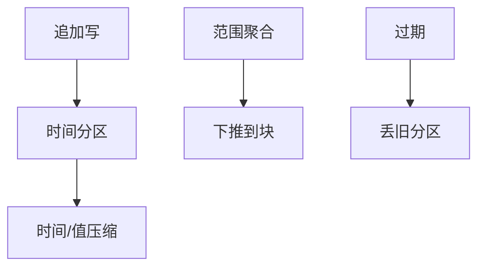

# 时序数据库

主键是时间与序列 id：写追加、读范围、旧数据降采样或过期。压缩与分区按时间切开，B+ 点查不是第一路径。

<footer>—— 据时序存储实践；LSM 与列压缩课的时间局部性；保留策略</footer>

[上一课](/cs/graph-db)多跳爆炸。本课时间轴：指标、日志、传感器。缺口是数据生命周期：高写、范围扫、冷热分层。关系表也能存时间戳，但缺自动分片保留、Gorilla 一类压缩、乱序窗口（流课再讲）。本课存储引擎形状。

## 问题

序列：`(metric, tags, timestamp) → value`。写：几乎追加。读：最近窗口聚合。缺口是 **tag 高基数**（每个用户一序列）打爆倒排与内存索引。压缩：时间戳 delta、值 XOR（Facebook Gorilla 思路）。分区：按时间切，丢旧分区即 TTL，比 DELETE+vacuum 便宜——表分区课的时序特化。

乱序写：迟到点要插进已压缩块，代价高，常有乱序缓冲。与 LSM：按时间 SST，compaction 少跨时间。

Influx、Timescale、Prometheus TSDB 是产品。Gorilla 论文讲内存时序压缩。本课机制。不进金融微观结构（量化栏）。

## 方法

设计 tag 基数。降采样：物化 1m/1h 聚合，即物化视图刷新。查询下推聚合到存储。与 CDC：时序很少改历史，流式追加。

索引：倒排 tag → 序列 id，再沿时间列存扫。位图可标稀疏存在。

## 机制

HTAP：OLTP 元数据一行，时序另一引擎。校准：压缩后扫描极快，优化器若当行存会估错。WAL：可按块。副本：时间范围副本策略与热数据多副本。

与窗口流：存储是历史，流是进行中的窗口——后课衔接。

## 边界

本课不讲 ANN。也不把时序当量化交易撮合。向量库下一课：嵌入检索，时间可当过滤不是主模型。

后课默认：时间范围+TTL 用时序引擎或时间分区。向量数据库与 ANN：高维近邻，不是时间轴。

高基数 tag 会把时序库用成昂贵的文档库。

## 小结

- 时序以时间分区、压缩、TTL 为第一设计。
- tag 基数与乱序写是主要税。
- 向量数据库与 ANN 下一课。
- 出处：Gorilla 压缩；LSM/分区课；TSDB 实践。
