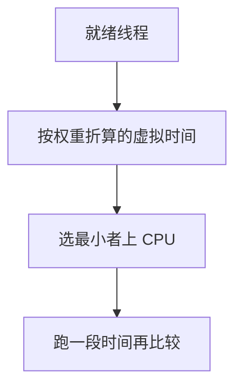

# 时间片与公平调度

完全公平调度试图让每条可运行任务分到与其权重成比例的 CPU 时间。

<footer>—— 据 Linux CFS 设计直觉；Silberschatz et al. 对轮转与公平的整理</footer>

[上一课](/cs/pi-pcp)给出响应与公平等尺子。轮转用时间片改善响应，但仍把每条线程当同等的「下一个量子」。缺口是：交互与后台、不同 nice，需要**按权重摊时间**，而不是固定队列转圈。本课用时间片与 CFS 的虚拟运行时间当直觉，不当成内核源码课。

## 问题

纯 FCFS 响应差；固定时间片轮转公平但无权重：后台编译与前台击键抢同一圈。缺口不是新的指标定义，而是一种分配：在任意窗口里，线程 $i$ 获得的 CPU 份额接近 $w_i/\sum w$。实现上，每次选「至今吃得最少（按权重折算）」的那条。

本课不把红黑树结点布局、`vruntime` 溢出细节写完，只钉这套直觉。

CFS 用虚拟运行时间：实际跑 $\Delta t$ 的线程，其 `vruntime` 增加约 $\Delta t \cdot w_0/w_i$。权重越大，虚拟时钟走得越慢，越容易被再次选中。

## 方法

时钟中断或主动让出时进入调度：比较可运行线程的虚拟运行时间，切到最小者；给它一段时间片（或直到它阻塞、直到别人的虚拟时间追上）。时间片不是魔法常数：太短切换开销压过吞吐，太长响应变差——尺子仍是上一课那些。

阻塞的线程不累积「亏欠到无限」的简单模型即可：醒来时把虚拟时间接到当前最小附近，避免一下子垄断 CPU。Linux 的具体补偿是实现，主干只要求不饿死、不让睡很久的人醒来瞬间吞掉全部核心。

## 机制

公平是对**可运行**集合而言：在磁盘上睡的人不应靠「睡着也涨份额」抢走交互。时间片把上一课的响应指标变成可调旋钮；权重把「公平」从人数均等改成份额均等。上下文切换次数随可运行集合与片长变化，所以公平策略仍付切换税。

本课不处理截止时间：公平摊时间可以让所有人错过期限。那是下一课实时调度的对照。

## 边界

本课不是 Linux 内核实验指导，不保证与某主线版本的字段同名。不引入实时策略（`SCHED_FIFO`）与 deadline 调度。也不把多核共享缓存的调度写成 NUMA 课。

交互性启发式（睡眠补偿）是实现，不是公平份额的定义；本课以虚拟时间为准。

后课默认：通用分时按权重摊 CPU，用虚拟时间近似。有硬期限的任务不能靠这一套，下一课对照。

## 小结

- 时间片改善响应；权重把公平从「人次」改成「份额」。
- CFS 直觉：跑得越少（折算后）越先上。
- 实时期限是另一套目标，不能从 vruntime 推出。
- 出处：Silberschatz et al., *OSC*；Linux CFS 设计讨论（Molnar 等），作直觉而非源码转写。
