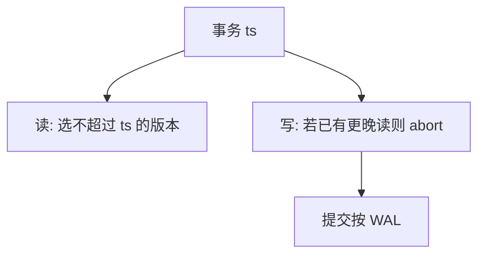

# 时间戳排序

每事务一个时间戳，读写按戳排序：晚读早写的数据则拒绝或等待。调度在时间轴上，不必两阶段锁点。

<footer>—— 据 Bernstein and Goodman 时间戳并发；Reed；Gray and Reuter；主干 2PL 对照</footer>

存储对照在[索引组织表](/cs/index-organized-table)封口。本课打开并发控制续：主干 [2PL](/cs/two-pl) 与 [MVCC](/cs/mvcc) 已给锁与版本。缺口是时间戳排序（TSO）：事务 $T$ 带 $ts(T)$，对象上维护读/写戳，冲突按戳序解决，实现可串行的一种。OCC 下一课更乐观。

## 问题

2PL 阻塞；死锁要检测。TSO：若 $T$ 写对象 $X$，但 $X$ 已被更晚事务读或写，则 $T$ 太晚，abort 并 vis 新戳重来（或 wait 变种）。Thomas 写规则：过时写可忽略而不 abort。缺口是**无锁点仍要拒绝乱序**，不是取消隔离。

多版本时间戳：写创建版本 $ts$，读取不超过自己戳的最近版——与 MVCC 合流。单版本 TSO 对读写冲突更苛刻。基本 vs 严格：是否等写者提交才让读者看见，对应脏读。

Bernstein, Hadzilacos, Goodman 教材。时间戳可由计数器或 TrueTime 后课一类时钟给。本课单机逻辑戳。

## 方法

对象元数据：`max_read_ts`、`max_write_ts`（及版本链）。读：若 $ts(T) \lt  max_write_ts$ 可能 abort 或读旧版。写：若 $ts(T) \lt  max_read_ts$ abort（已有更晚读）。提交：刷日志仍 WAL。

与快照隔离：SI 用开始戳读，提交戳写检测，不是完整 TSO。本课 TSO 更接近「调度等价于戳序串行」。

## 机制

重启：时间戳必须单调，不能回卷导致旧事务变「未来」。时钟回拨是分布式课。长事务拿极早戳会与后续写大量冲突——和 MVCC 老快照挡 GC 对偶：这里是活锁/重试。

锁与 TSO 混合存在于产品，本课纯机制。死锁少（更多 abort），重启风暴是代价。

## 边界

本课不讲 OCC 的读集验证。也不把 TSO 当网络协议。间隙幻读：谓词读写仍要谓词戳或间隙结构，后课。

后课默认：可用时间戳接受/拒绝代替 2PL 阻塞。OCC：先无锁读写工作副本，提交时验证。

戳序是可串行的充分实现之一，不是用户看见的隔离级别名。

## 小结

- TSO 用对象上的读写戳拒绝乱序访问。
- 多版本变体与 MVCC 合流；过时写可 Thomas 忽略。
- OCC 下一课：验证在提交点。
- 出处：Bernstein and Goodman；Reed；Gray and Reuter。
