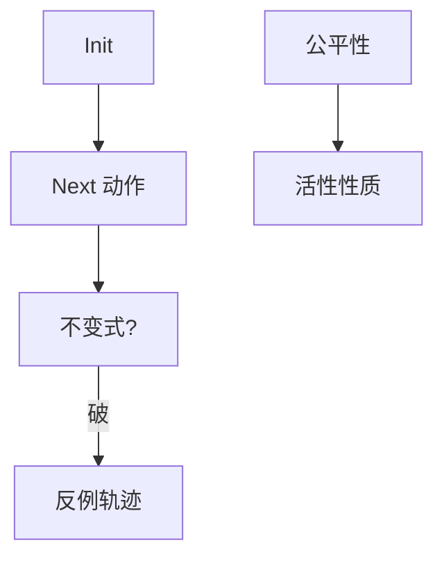

# TLA+

用状态与下一步关系写规格，模型检测穷举交错。Raft 与许多工业协议用它抓到实现者想不到的洞。它检查规格，不生成可部署代码。

<footer>—— 据 Lamport, Specifying Systems；Newcombe et al., How Amazon Web Services Uses Formal Methods, CACM 2015；Ongaro Raft TLA+ 整理</footer>

上一课[滚动升级](/cs/rolling-upgrade)把混合版本交错变成现实。缺口是**人脑画不全交错**：Paxos 活锁、Raft 旧任期提交、成员变更。TLA+ 把[RSM](/cs/replicated-state-machine)与共识写成变量与 Next。本课钉直觉，不教安装。分布式系统课程在此封口；后课安全进阶另起。

## 问题

TLA：时序逻辑 + 动作。规格 = 初始谓词 + Next + 公平性。安全：不变式（如「两主不能同任期提交不同值」）。活性：在公平调度下终发生。模型检测 TLC 在有限实例（2–5 节点、短日志）上穷举；超出则靠定理证明或缩小模型。

缺口：测试给一条轨迹，检测给一类轨迹。Jepsen 打实现，TLA+ 打规格与算法；实现仍能写错。Amazon 用 TLA+ 查 DynamoDB/S3 内部协议故事见 CACM 2015。

Lamport 的书是源头。Raft 仓库带 TLA+。本课不发明 arXiv。PlusCal 是更像伪代码的前端。

## 方法

写：变量（日志、term、角色），动作（超时、投票、追加）。不变式：选举安全、日志匹配。检查：从小 $n$ 开始，加成员变更再跑。反例轨迹对照[追踪](/cs/distributed-tracing)的思维，但是完备交错。

不要把 TLC 绿当成无限状态证明。有限模型是抽查。

## 机制

与证明助手：TLA+ 工业路径偏模型检测；Coq/Lean 偏构造证明。分布式课接 FLP：活性规格必须声明公平或部分同步假设，否则检测器会报「可不终止」——那是定理，不是工具坏了。

本课不写全部时序算子。也不把 TLA+ 当 LLM 对齐工具。

滚动与地理：把「新旧消息」做成 Next 的两种动作，比生产金丝雀更早看见双主。这是本课序收束的理由：前面所有协议都是状态机，TLA+ 是它们的共同语言。

## 边界

本课不替代实现测试、混沌、Jepsen。后课默认：改共识与复制协议先有规格与小模型；绿不表示代码对。分布式系统从故障模型走到规格语言。安全进阶从 [一次一密](/cs/one-time-pad-perfect-secrecy) 另起，不把 TLA+ 当加密证明。

分布式系统从故障模型走到规格语言。中间每一课都是某一种状态机与某一种对手。TLA+ 把对手写成 Next 里的分支。

## 小结

- TLA+：状态、Next、不变式；TLC 穷举有限实例。
- 安全与活性分开写；活性要公平/同步假设。
- 查规格与算法，不替代实现对抗测试。
- 出处：Lamport, *Specifying Systems*；Newcombe et al., CACM 2015；Raft TLA+。
