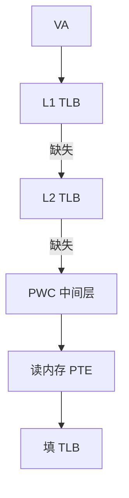

# 多级 TLB 与页表缓存

L1 TLB 要小而快，覆盖不住就下到 L2 TLB；再缺失则走页表，页表缓存把中间层 PTE 留住，避免每次从根走四次访存。

<footer>—— 据 Barr, Cox, and Rixner, Translation Caching, MICRO 2010；Hennessy and Patterson, CA:AQA 整理</footer>

[上一课](/cs/write-combining) 的合并在 PA 上进行。[TLB 翻译](/cs/tlb-translate) 已给出一次查找。VIPT 与大工作集让 L1 TLB 覆盖成为瓶颈：4KiB 页 × 64 项只有 256KiB 的 VA。本课不重讲 walk 的四级格式。缺口是**TLB 层次 + 页表缓存（PWC / MMU cache）**。

## 问题

每个 load 都要 VA→PA。L1 TLB 全相联或小组相联，项数有限。缺失若直接走内存中的页表，[Sv39](/cs/sv39-page-table) 一类要多次依赖访存，MLP 帮不上这条链。缺口不是更大的 L1D，而是**二级 TLB 放大覆盖，以及把页表中间节点缓存在 MMU 旁。**

PWC：缓存非叶 PTE，下一次 walk 可以从中间层开始。Barr–Cox–Rixner 比较了各种 translation cache 的组织。

## 方法

L1 TLB：分 I/D，低延迟。L2 TLB：更大，统一或分裂，缺失才 walk。Walk：硬件有限状态机读 PTE；每层可查 PWC。ASID 命中避免切换全冲。全局页可跨 ASID 保留。

## 机制

TLB miss 的 CPI 可以超过 cache miss：因为它串在地址生成之后、cache 访问之前（PIPT）或并行失败时（VIPT 标签等 PPN）。[MLP](/cs/mlp-memory-parallelism) 对 walk 内部的串行读几乎无效。大页下一课用一项覆盖更多 VA，直接减 miss。

Shootdown：[tlb-shootdown](/cs/tlb-shootdown) 必须覆盖所有级与 PWC，否则别名与过期 PPN。

## 边界

本课不把软件 fill（老 RISC）当当代主干。也不把嵌套虚拟化的二次 walk 写完（EHT/EPT），只承认会成倍放大 PWC 的价值。大页覆盖是下一课专门的几何。

后课默认：翻译有 L1/L2 TLB 与 PWC。同一项能盖住 2MiB 而不是 4KiB 时，覆盖率的账完全改写。

## 小结

- 多级 TLB 分层延迟与覆盖；PWC 截短页表游走。
- walk 是串行访存，MLP 难救。
- 大页用一项扩大覆盖，是下一课。
- 出处：Barr, Cox, Rixner, *MICRO*, 2010；Hennessy and Patterson, *CA:AQA*。
