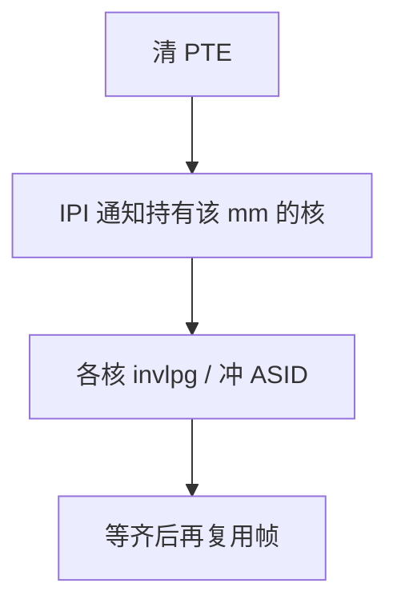
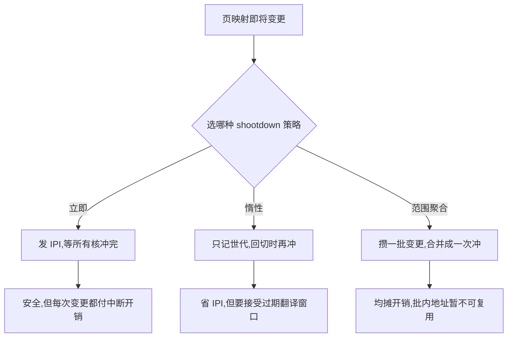

# TLB shootdown

页表改了只保证本 CPU 看见新翻译；其他核的 TLB 仍可能缓存旧的 VPN→PPN，必须显式作废。

<footer>—— 据 Black et al. 对 MACH 多处理器 TLB 一致性的讨论；Love, Linux Kernel Development 整理</footer>

[上一课](/cs/huge-pages)让一条 TLB 项覆盖更大块。[TLB](/cs/tlb-translate) 是每核私有的旁视缓冲，不是共享页表本身。[缺页路径](/cs/page-fault-path)在本 CPU 填表并局部冲 TLB。缺口是**多核**：解映射、改权限、拆大页之后，别的核若仍用旧项，会写出已不属于该进程的物理页。

## 问题

页表在内存里，改 PTE 对所有核「最终」可见，但 TLB 是各核 SRAM 副本。没有总线嗅探来自动丢翻译项。缺口不是再讲 ASID，而是：发起核发出核间中断（IPI），请其他核执行 `invlpg` 或冲本进程的一组项，并等待它们做完——这叫 shootdown。范围过大则变成全核风暴；过小则漏冲。

数字实例：一次 TLB 命中在纳秒级，而一次 IPI 从发出、目标核中断进出到应答，常常以微秒计——差三个数量级以上。几十核机器上 munmap 一段被广泛共享的映射，能打出几十次 shootdown 中断，开销立刻可测。

本课不把每种 ISA 的 INVLPG 编码写完。

惰性 shootdown：记下「世代」，核回到该进程时再冲。降低 IPI，换来短暂的过期翻译窗口，必须与 ASID/PCID 或「该页已不可写」等约束搭配。

## 方法

解映射：锁页表，清有效位，对本 CPU 冲 TLB，向持有该 mm 的 CPU 集发 IPI。各核在中断里冲指定 VA 或整张用户 TLB，应答。发起者等到齐再复用物理帧——否则 DMA 或别核 store 仍打旧帧。大页 shootdown 按大页基址作废。

```mermaid
flowchart TD
  UNMAP["清 PTE"] --> IPI["IPI 通知持有该 mm 的核"]
  IPI --> INV["各核 invlpg / 冲 ASID"]
  INV --> WAIT["等齐后再复用帧"]
```

## 机制

shootdown 把 [TLB](/cs/tlb-translate) 从「单核加速」接到「多核正确性」：它是虚存的一致性协议，对象是翻译，不是数据 Cache 行（数据一致性仍走 MESI 课）。频繁 `mprotect`、munmap、大页拆分会让 IPI 成为可测的开销，于是有范围聚合与惰性策略。

```mermaid
flowchart TD
  CH["页映射即将变更"] --> S{"选哪种 shootdown 策略"}
  S -->|"立即"| IM["发 IPI,等所有核冲完"]
  IM --> SAFE["安全,但每次变更都付中断开销"]
  S -->|"惰性"| LA["只记世代,回切时再冲"]
  LA --> WIN["省 IPI,但要接受过期翻译窗口"]
  S -->|"范围聚合"| RA["攒一批变更,合并成一次冲"]
  RA --> AMP["均摊开销,批内地址暂不可复用"]
```

术语翻译：shootdown 字面意思是「把飞行物打下来」。页表改完，别的核 TLB 里那枚旧 VPN→PPN 还在「天上飞」——不主动打下它，接下来的访存还会落回已经被抢走的物理帧。名字夸张，说的正是「必须显式作废」这件事。

不要把页表 walker 再推一遍：walker 读的是内存中的新 PTE；错误来自旁路缓冲。

## 边界

本课不引入 x86 PCID 与 INVPCID 的全部优化表。不把 GPU 的自己的 TLB 写进主干。内核映射全局项（用户/内核分裂里的高半）改动更危险，通常极少改或用专门全局冲。下一课假设：帧要被抢走时，翻译已经到处作废。

后课默认：解映射在多核上可完成。无空闲帧时淘汰谁、如何选牺牲页，下一课缺页与置换。

常见误区：初学者容易以为硬件缓存一致性（MESI 那类协议）会顺带把 TLB 也同步了。实际 MESI 管的是数据 Cache 行；TLB 是旁视结构，不在嗅探范围内，翻译过期只能靠指令或 IPI 显式作废——这正是 shootdown 存在的理由。

## 小结

- 改 PTE 后必须 shootdown 他核 TLB，才能复用帧。
- IPI 是开销；惰性与范围聚合是实现。
- 无帧时的淘汰算法是置换课的缺口。
- 出处：Black et al. 对 MACH TLB；Love, *LKD*；Tanenbaum *MOS*。
