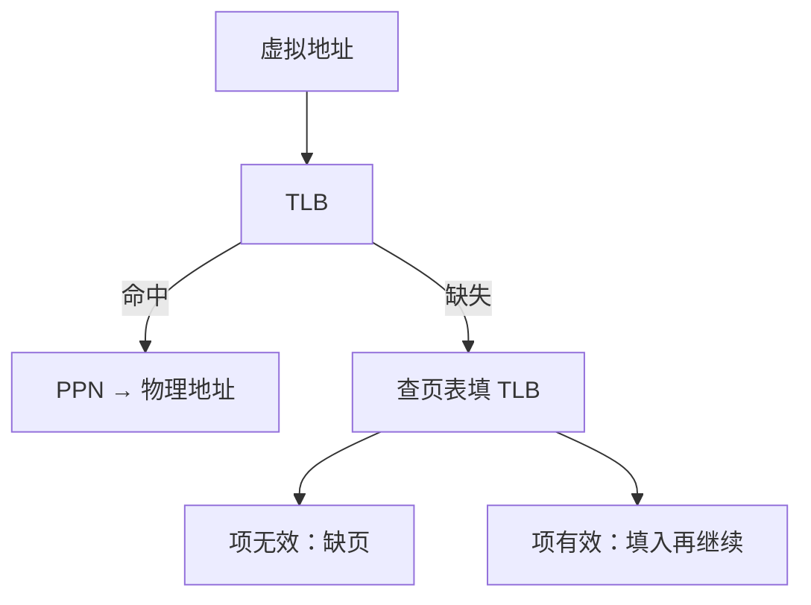

# TLB

页表在 DRAM 里，每次 load 先查表再访存会把 CPI 毁掉；把最近的 VPN→PPN 放进 SRAM 相联阵列，翻译才跟得上流水线。

<footer>—— 据 Patterson and Hennessy, Computer Organization and Design (RISC-V) 整理</footer>

[上一课](/cs/paging-vm)让每条访存先走页表。页表本身是 DRAM 中的数组，一次翻译至少再付一次访存，缺失时更多。[局部性原理](/cs/paging-vm)对 VPN 同样成立：近期用的页还会再用。[直接映射 Cache](/cs/direct-mapped-cache)已经演示过标签阵列。本课不重讲页表项里的权限位。缺口是：翻译必须有自己的小 cache。本课只交出 TLB。

## 问题

五级 MEM 级一拍要完成「虚拟地址 → 物理地址 → cache」。若每拍走 DRAM 页表，翻译延迟与缺页同量级，流水线退回多周期。缺口不是取消分页，而是**用相联 SRAM 记住少量最近翻译**，命中则一拍给出 PPN。

TLB 缺失不是缺页：页可能在 DRAM，只是翻译没在 TLB 里。硬件或软件再去走页表，填 TLB。缺页仍按上一课的精确异常走。

TLB 是翻译旁视缓冲，不是数据 cache。它存的是页表项的副本，粒度是页。

## 方法

TLB 条目：VPN 标签（或标签+索引）、PPN、有效、权限、有时 ASID。全相联或小规模组相联，因为条目少。访存时并行查 TLB 与（若用虚拟索引）cache；TLB 命中则用 PPN 完成物理标签比较。

进程切换要换地址空间：刷 TLB，或用 ASID 避免全刷。本课承认必须处理，不把 ASID 编码写完。

## 机制

TLB 命中率极高时，翻译不出现在 CPI 里。TLB 缺失代价是若干次页表访存，仍远小于缺页的磁盘。权限位在 TLB 里检查，与页表一致；内核改页表后必须作废对应 TLB 项，否则保护被绕过。

多层 cache 与 TLB 的顺序（先译后查物理 cache，或虚拟 cache 再别名）是实现细节。本课要求：最终数据必须对应正确的物理页，且权限已被检查。

## 边界

本课不引入多级页表走访的硬件状态机——单级表走一次即可。64 位下表太大，下一课才切级。也不把 TLB 缺失算进 cache 的三类缺失；它是翻译停顿，另加进 CPI。

后课默认：每条访存先看 TLB；命中则翻译对软件不可见。改页表的特权代码负责作废条目。

## 小结

- TLB 缓存 VPN→PPN；命中让翻译跟上流水线。
- TLB 缺失是走页表，不一定缺页。
- 多级页表是为了表本身的空间，下一课才切。
- 出处：Patterson and Hennessy, *COD* RISC-V TLB；Hennessy and Patterson, *CA:AQA*。
