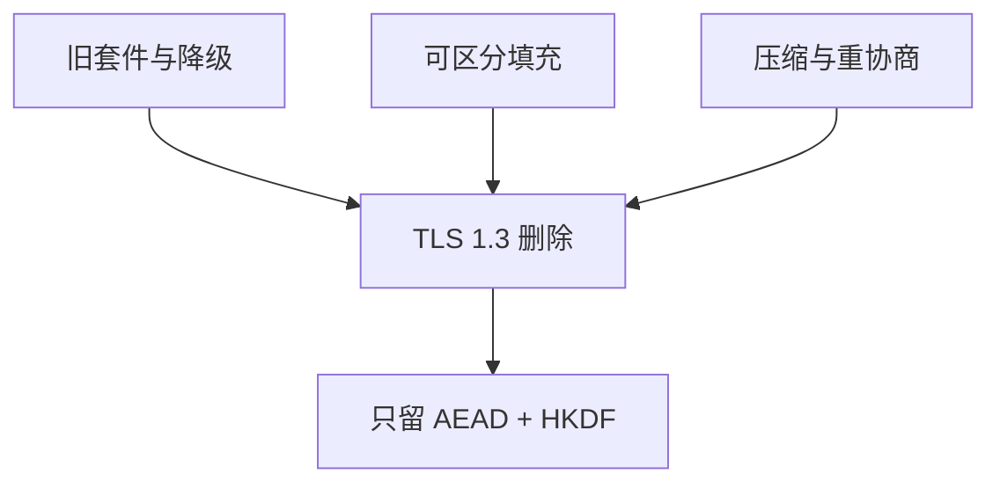

# TLS 攻击史

TLS 的历史是合同一次次被实现与降级打穿：明文恢复、填充预言、导出密钥、版本回退。TLS 1.3 删掉的东西，多半是这份名单教过的。

<footer>—— 据 RFC 8446 的设计动机；Rescorla, *The Transport Layer Security Protocol*；对照 Vaudenay 与 BEAST/Lucky Thirteen 的公开分析</footer>

## 定位

上一课[ACME](/cs/acme)让证书常见。缺口是**记录层与握手曾怎样失败**。主干[TLS 握手](/cs/tls-handshake)已有 1.2/1.3 形状。本课用历史当反例清单：降级、可区分错误、压缩、重协商——不给复现步骤。

后课默认已经读完本课钉下的合同，只补差，不从该领域第一性原理重开。

## 问题

证书对了，记录层仍可能用 CBC+MAC、导出、压缩。攻击史说明：主动敌手改握手选弱套件；计时区分填充；压缩与密钥同流。TLS 1.3：只 AEAD、HKDF、去掉重协商与压缩。缺口是「为何删」，不是再背扩展号。

### 降级是协议漏洞

回退到 SSL 3.0 或出口套件不是用户偏好，是敌手可选的模式。版本与套件必须认证绑定。

RFC 8446 引言即针对旧缺陷。POODLE、BEAST、CRIME、Heartbleed 作为失败模式点名：实现越界读也算史。本课禁止操作指导。

## 方法

按层分类：握手绑定、记录完整性、压缩、实现内存。每类对应 1.3 的一条删除或加固。指出中间盒终止 TLS 会重开这些选择。

图中节点是本课的机制骨架；课程不把图展开成可运行的攻击步骤。

## 机制

协议安全是版本化的合同。部署「兼容一切」等于把最弱环留给主动者。后课 SSH/IPsec/WireGuard 是另一些合同，不要假设「已有 TLS」覆盖它们的威胁模型。

前提写进合同之后，游戏外的误用只当失败模式点名，不在本课写成操作程序。

## 边界

本课不分析某一 CVE 的报文。SSH 下一课：主机钥与用户钥，另一条远程管理信道。

## 小结

- 证书自动化之后，记录层历史说明要删弱合同。
- 降级、填充预言、压缩是主动敌手的经典通道。
- 1.3 的缩小表面是设计结论，不是审美。
- 下一课 SSH 密钥认证。
- 出处：RFC 8446；Rescorla；Vaudenay, 2002；对照 Anderson。
