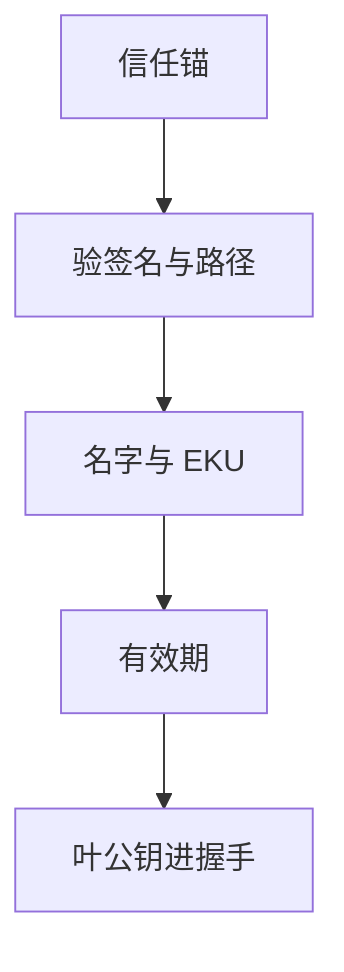

# 证书链验证细节

「有一张证书」不是验证。验证是：从信任锚走到叶，检查签名、名字、时间、用途与吊销，任何一环跳过都等于把 PKI 收成装饰。

<footer>—— RFC 5280；RFC 6125；对照 Anderson 对 PKI 失败</footer>

## 定位

上一课[密码学误用](/cs/crypto-misuse)把算法合同外的失败收成清单。下一单元从**身份绑定**起：主干[证书与 PKI](/cs/cert-pki)已有链的形状。缺口是实现里常被关掉的那些检查——名字约束、EKU、路径长度、时钟。

后课默认已经读完本课钉下的合同，只补差，不从该领域第一性原理重开。

## 问题

误用课的「关校验」在 TLS 里表现为：不验主机名、接受过期、不跟到锚、把中间当锚。RFC 5280 的路径构建与 RFC 6125 的标识。缺口是验证算法的合同，不是再讲 X.509 字段百科。

### 自签与私有锚

私有 CA 要把锚配进信任库，而不是在客户端 `verify=False`。测试开关进生产是规格事故。

RFC 5280 路径验证；CAB 基线约束浏览器锚。本课不写如何伪造证书的步骤。时钟来自[物理时钟](/cs/clock-drift)的假设：过期检查依赖大致正确的时间。

## 方法

按构建→验证签名→名匹配→KU/EKU→有效期→策略约束走一遍。指出中间证书必须由锚或下一中间签发，叶不能当锚。吊销下一课 CT 与 OCSP 的缺口先点名。

图中节点是本课的机制骨架；课程不把图展开成可运行的攻击步骤。

## 机制

TLS 握手里的证书只是声明。验证失败应中止，不应「警告后继续」当默认。钉死：后课 CT、ACME、攻击史都假设本课的检查还在。

前提写进合同之后，游戏外的误用只当失败模式点名，不在本课写成操作程序。

## 边界

本课不把全部扩展 OID 列成表。证书透明下一课：验证只保证「某锚签过」，不保证「锚没被骗着签」。

## 小结

- 误用清单之后，PKI 的合同是路径验证而不是「有文件」。
- 锚、签名、名字、用途、时间缺一则握手不应成功。
- verify=False 与测试锚进生产同属关掉游戏。
- 下一课证书透明：发现误签。
- 出处：RFC 5280；RFC 6125；Anderson, *Security Engineering*。
