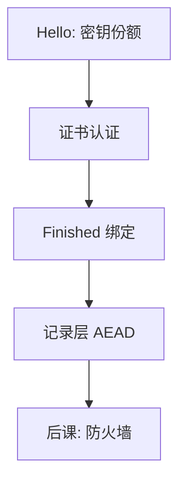

# TLS 握手

握手一次性做完：协商版本与套件、用证书认证服务器、派生会话键，随后记录层用 AEAD 保护字节。

<footer>—— RFC 8446, The Transport Layer Security (TLS) Protocol Version 1.3</footer>

[上一课](/cs/transient-exec)把微结构泄漏标进模型。本课不谈缓存。网络课已有[TLS 入口](/cs/http-tls-entry)：HTTPS 在 HTTP 下加一条保密管道。缺口是：握手如何把[公钥信封](/cs/pubkey-envelope)、[证书](/cs/cert-pki)、[AEAD](/cs/symmetric-crypto)装成一次协议，使后续套接字字节带 CIA 的 C 与 I。

## 问题

只「开始加密」不够：要防降级、要认证名字、要前向保密、要 Finished 绑定。TLS 1.3 把密钥交换收成 ECDHE（或 PSK），证书在加密之后发，减少明文元数据。缺口不是重讲 TCP 三次握手，而是记录层与握手消息的分工：明文只留下为了把会话建起来所必需的那几项。

1.3 去掉了大量历史套件与 RSA 静态密钥交换，正是为了关掉「没有前向保密」与「加密但不认证」的组合。旧版本对照见网络课入口，本课以 1.3 为机制。

## 方法

ClientHello / ServerHello 协商群与密钥份额；双方派生握手密钥与应用密钥。服务器出示证书链，用私钥证明；客户端核验证书与主机名。Finished 用 MAC 绑全部握手字节，防改套件。之后应用数据走 AEAD。本课不写报文字段表当实现抄本。

## 机制

握手服务真实性 + 密钥协商；记录层服务保密与完整。这把认证协议课的「绑到会话键」做成互联网默认实例。中间盒子若要看见明文，必须成为端点（终止 TLS），从而进入另一威胁模型——后课中间人。0-RTT 用 PSK 提前发数据，有重放窗口，是可用性与安全的挤法，本课只点名。

证书在 1.3 里于加密后出示，减少明文元数据，不减少必须验链这一步。

## 边界

TLS 不保护端点内存、不保护 DNS 若未另行认证、不保护证书误签。也不把 QUIC 的加密运输再推一遍——[QUIC 对照](/cs/quic-contrast)已在网络课。防火墙看到的往往是已加密的流，下一课只能按连接状态而不是按 URL 过滤。

会话票与 PSK 恢复必须当密钥材料保护，否则握手再短也把长期秘密拉长暴露面。后课默认：链路在 1.3 记录层下有会话键；边界设备面对的是五元组与状态，不是明文 HTTP。

握手本身也是 DoS 面：公钥运算贵。后课可用轴会回到这里；本课先把正确协商钉死。

## 小结
- Finished 把握手字节绑进密钥，防改套件与降级。
- 后课防火墙在加密流上只能看见五元组与状态。

- 入口课有管道；本课把 1.3 握手收成协商、证书、Finished、AEAD。
- 前向保密来自临时 DH；认证来自 PKI 名字绑定。
- 加密后过滤只能靠连接状态，是防火墙课缺口。
- 出处：RFC 8446；对照 Diffie–Hellman 与 AEAD 先修。
