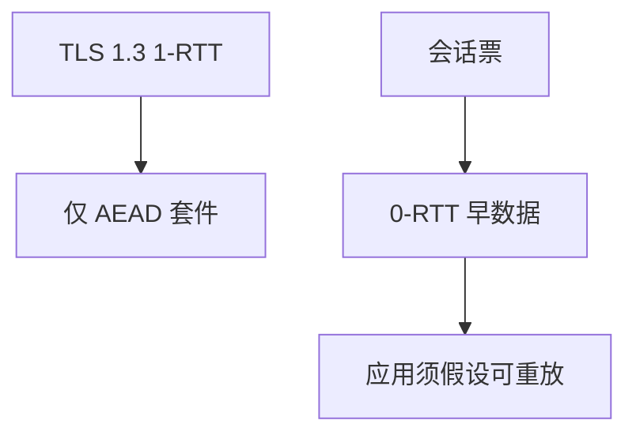

# TLS 1.3 与 0-RTT

1.3 只保留 AEAD、强制（EC）DHE、压缩握手；0-RTT 用上次票提前发应用数据，换来重放窗口。

<footer>—— RFC 8446, TLS 1.3</footer>

[上一课](/cs/tls-handshake)给出握手：证书、派生、记录层 AEAD。本课不重画完整证书链。缺口是 RFC 8446 相对旧版的收缩，以及 **0-RTT**：用预共享的恢复密钥在第一个往返之前发送数据。防火墙下一课是边界上的流状态，不是握手。

## 问题

握手课用 1.3 当默认叙事。需要钉差：去掉 RSA 密钥传输与非 AEAD 套件（[DH 与 RSA 分工](/cs/dh-vs-rsa) 已铺垫），Hello 里带密钥份额，通常 1-RTT 完成。0-RTT：客户端用上次 NewSessionTicket 派生的密钥直接带应用数据。DY 敌手可以**重放**那一段早数据——规格允许，应用必须幂等或拒绝。缺口是**延迟与重放的取舍**。

0-RTT 数据没有前向保密相对于那张票的泄露窗口。服务器可关 0-RTT。HTTP GET 缓存友好请求相对更适合，仍要应用自己判断。

## 方法

完整握手：共享秘密进 HKDF，导出流量密钥。恢复：PSK 或票加新鲜 DH（1.3 推荐组合）。0-RTT 密钥从 PSK 导出，服务器在确认后才升级到正式流量密钥。本课不把中间盒对 1.3 可见性的政策写成标准。

## 机制

1.3 把模式课与公钥课收成不可再选弱组合。0-RTT 把[HTTP 幂等](/cs/http-semantics) 变成安全合同：非幂等请求不应放进早数据。记录层仍服务链路 CIA 的 C/I；端点与 0-RTT 重放是另一轴。

## 边界

本课不引入 GREASE 等兼容技巧当必懂。边界网关上谁被放行，下一课防火墙与状态。

后课默认：1.3 默认 1-RTT；0-RTT 带重放假设。分组过滤是另一层。

## 小结

- RFC 8446：AEAD、DHE、更短握手。
- 0-RTT 用票换延迟，应用必须当重放。
- 防火墙下一课。
- 出处：RFC 8446。
