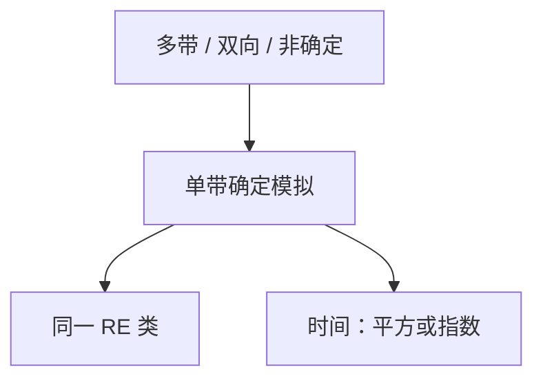

# 图灵机变体与等价

多带、双向无限带、非确定、只许在空白上写：识别能力都回到单带确定机；差的是步数多项式还是平方。

<footer>—— 据 Hopcroft and Ullman；Sipser 整理</footer>

上一课[图灵机](/cs/turing-machine)钉了单带确定 TM。缺口是课堂与文献里一堆变体：是否「更强」。本课只做**语言类等价**，并登记模拟的代价——复杂性单元会用「多项式等价」这一句，本课不定义 P。

## 问题

多带：有限条带、每步各头独立移。模拟：单带把多道内容交错存放，头位置用记号，一次移动可能扫整段非空白，时间平方。双向无限带：折成两轨。只读输入 + 工作带：仍等价。非确定 TM：$\delta$ 给集合，接受当存在一条接受路。模拟：BFS 枚举配置，可识别同一类；时间指数，这是后课 NP 的伏笔，本课不命名 NP。

枚举器：打印 $L$ 中所有串（可重复、可乱序）。$L$ 可被枚举 $\iff$ 可被 TM 识别。这把 0 型「生成」说成机器。

### 等价不是效率相同

单带认 $\{wcw\}$ 需要来回扫，多带线性。语言类相同，具体 $O(\cdot)$ 不同。后课时间层级必须先固定模型；多项式类在标准变体间稳定。

Hopcroft–Ullman 专章写模拟。Sipser 把非确定识别与枚举器放在可计算性开头。线性加速定理点名：常数因子可吃掉，本课不证。

## 方法

对每一种变体给模拟思路：交错、折带、配置树广度优先。不要用「图灵机很强所以显然」代替模拟。只读带不能当工作纸：那会退回有限自动机一类，除非另给工作带。

[NFA 与 DFA](/cs/nfa-dfa) 的子集构造是「非确定不扩大正则」。TM 的非确定也不扩大 RE，但扩大的是后课的时间类。

## 机制

配置仍有限描述（头位置、有限非空白），故可编码成串，通用机与对角化才有对象。变体等价保证：后课写「存在 TM」时不必声明几条带。随机访问 RAM、while 程序，后课论题才对齐；本课停在带状机器内部。

停机与否对变体同时成立：能模拟则能把循环一起模拟。

只许向右写的「实时」机、多栈、计数器机，只要能模拟带，语言类仍是 RE。双栈已经够用：一条当左带，一条当右带。线性加速不改变类，只吃常数。后课时间层级必须先声明「多带」或「单带」，因为模拟的平方因子会吃掉过窄的空隙。

## 边界

本课不引入预言机，不证 $k$ 带与单带的精确时间上界全文。不把量子或电路当变体。后课默认：RE 对标准变体不变；谈具体时间先固定单带或多带。下一课把「算法」对齐到这一模型。

后文写「存在图灵机」时，默认可换成多带或非确定而不改语言类。谈具体 $O(T(n))$ 必须先声明模型。随机访问 RAM 的多项式等价留给复杂性约定。

## 小结

- 多带、双向、非确定 TM 认同一类语言。
- 模拟有多项式或指数代价；语言等价 ≠ 同样快。
- 枚举器 = 识别器。
- 出处：Hopcroft and Ullman；Sipser。
