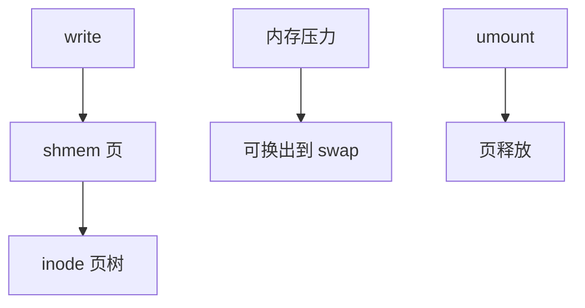

# tmpfs

tmpfs 把页缓存当成唯一存储：inode 与数据都在内存，交换出去才落到交换设备，卸载即逝。

<footer>—— 据 Snyder, tmpfs: A Virtual Memory File System；Linux tmpfs/shmem 文档</footer>

[上一课](/cs/rename-atomicity)的原子改名对内存树同样成立，只是没有日志设备。[页缓存](/cs/page-cache) 对普通文件是「盘的缓存」；tmpfs 反过来：**文件就是页**。缺口是 shmem/tmpfs 如何接 VFS 与虚存，包括 `/dev/shm` 与 POSIX 共享内存。

## 问题

管道与套接字不是目录树。需要可 `mmap`、可有名字、可限额的内存文件：构建目录、密卷、容器根的一层。tmpfs 挂在 VFS 上，超级块在内存，块分配器是 `shmem` 的页。缺口：容量上限（`size=`）与 [memcg](/cs/memcg) 的交叉；内存压力下页可进 swap，于是「内存 FS」仍可能读盘；不进 swap 的锁定页是另一旋钮。

ramfs 通常不换出、不限额，可把机器撑死。tmpfs 有大小上限。教学上以 tmpfs 为准。

## 方法

`write`：分配页，插入 inode 页树，不调用 `readpage` 去块设备。`mmap` 共享即映射这些页，与 [mmap 一致](/cs/fs-mmap-coherence) 同一帧。`rename` 只改内存 dentry。对照 [F2FS](/cs/f2fs)：没有 NAT 下盘。对照 [overlay](/cs/overlayfs)：upper 常常是一块 tmpfs，copy-up 的可写层随容器消失。

## 机制

tmpfs 证明 VFS 不绑定「块设备」：操作表填的是内存。它把 POSIX 文件接到 [buddy](/cs/buddy-allocator) / 页回收，使 IPC（共享内存对象）与 `/tmp` 加速成为同一实现。不要把 tmpfs 写成数据库内存表：没有 WAL，崩溃丢失是语义。

快照：除非下层是 COW 且 tmpfs 不在那层，普通 tmpfs 无持久快照。

实现上：size 上限按页，大页 THP 会使实际占用跳变。swap 启用时「内存 FS」仍可能读盘，mlock 的 tmpfs 页才真正钉住。/dev/shm 与 POSIX shm_open 走同一 shmem。 读法上只引用[上一课](/cs/rename-atomicity)的结论，不把对象换成训练推理或限价簿。

本课在操作系统进阶的「文件系统实现 / 接口进阶」课序里，对象是 **tmpfs**。

- 先修只引用，不重导：上一课的结论当公理，本课只补差。
- 五栏不吞并：不把本课写成大模型训练/推理，也不写成限价簿或权重量化。
- 文献用 OSTEP、McKusick、内核文档与具名会议论文；不发明 arXiv 编号。

## 边界

本课不引入 huge-tmpfs、DAX tmpfs 的全部页大小。不保证 NUMA 放置策略——[NUMA 策略](/cs/numa-mempolicy) 在内存进阶。下一课把「不是普通文件」的 inode 钉住：设备节点。

版本字段会变，课序钉的是机制对象「tmpfs」，不是某一主线内核的结构体名。
后课默认：可挂载的内存树走 shmem。字符/块设备如何作为目录项出现，下一课设备节点。

## 小结

- tmpfs 用页缓存当数据，可换出，卸载即空。
- 与 ramfs 的差别主要是限额与换出。
- 设备节点是下一课。
- 出处：Snyder, tmpfs；Linux shmem；McKusick 对内存 FS 的对照。
