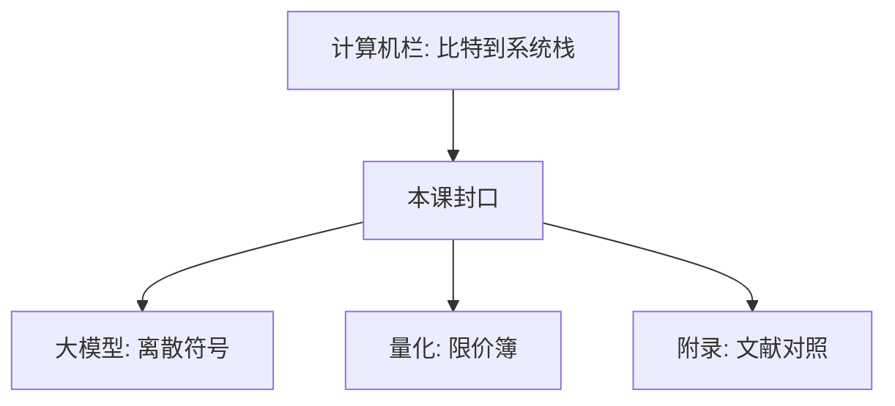

# 计算栈到此为止

从比特到隔离与会话，系统栈在此封口；词表上的训练、盘口上的价格，是另外两栏的第一课，不在这里续写。

<footer>—— 本栏课程序列的边界声明</footer>

[上一课](/cs/injection-boundary)把不可信输入收到解释器边界。本课不补一种新协议，也不重做注入分类。缺口是：计算机栏从[比特作为区分](/cs/bit-as-distinction)走到组成、体系结构、数据与算法、编译、操作系统、网络、数据库、安全，对象始终是可执行的系统栈。再往前写就会吞并别的栏，或把附录论文插进主干。本课只封口并移交。

## 问题

栈已经能表示数、跑指令、调度进程、传报文、提交事务、谈 CIA。若在此续写注意力、残差或限价簿队列，就违反五栏互不吞并：大模型是 Transformer 与训练/推理；量化是金融微观结构与定价。金融与光刻是另两栏。缺口因此不是「计算机还有很多词条」，而是**停在系统边界**，把读者送到正确的第一课。

论文、教科书、EDVAC 报告是附录对照，不插入主干。下一篇起标「附录对照，不插入主干」，从 Turing 1936 起按文献读，不按课序进度读。

## 方法

主干在本课结束。大模型栏从[离散符号](/llm/token-as-discrete-unit)再起：那里假定词表已在，不问页表与 WAL。量化从[限价簿](/quant/lob-structure)起：价格与队列是市场对象，不是本栏的套接字缓冲。金融栏接到限价簿为止，不在本栏重写 LOB；光刻走成像与产线。本栏也不重写 Transformer。

## 机制

封口的机制是课序约定，不是一条新定理。后课（附录）只对照原文如何第一次写出本栏已经用过的观念：可计算、存储程序、通信、互斥、关系、公钥方向。读附录不能替代从比特读到本课。安全课最后几课已经假定 OS 隔离与 TLS 入口；它们不延伸到对抗样本或市场操纵。

附录文献按时间与主题对照主干已经用过的观念，不把课序再往前推一格。

## 边界

本课不总结每一张知识树叶子。不把「全栈工程师清单」写成小结。也不在这里开始训练循环或 CAPM。若还缺系统课，应插在本课之前的主干里，而不是写在附录当论文读。

安全课的机制停在协议、隔离与可用；对抗样本、市场操纵、光刻工艺不是本栏对象。后课默认：主干已结束。附录第一篇对照 Turing 1936，链接回本课，并声明不插入主干。

本课没有新对象。读完 DoS，CIA 三轴都有机制名字，系统栈闭合。附录从下一篇起按文献对照，不再推进课序。

## 小结
- 五栏互不吞并：本栏不写注意力，不写盘口队列。
- 附录从 Turing 1936 起对照文献，声明不插入主干。

- 计算机栏停在系统栈：组成到安全，不含 Transformer，不进入限价簿。
- 大模型从[离散符号](/llm/token-as-discrete-unit)再起；量化从[限价簿](/quant/lob-structure)起；金融与光刻是另两栏。
- 附录对照文献，不推进课序。
- 出处：本栏课程序列；五栏互不吞并的写作约定。
