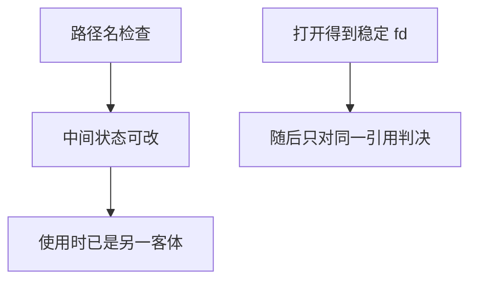

# TOCTOU

先检查后使用之间，客体可以换人；权限判断必须落在同一不可分割的引用上，而不是落在可被改写的路径名上。

<footer>—— 据 Saltzer and Schroeder 对完整中介；Anderson；文件系统 TOCTOU 的经典机制叙述</footer>

[上一课](/cs/capability-vs-acl)对照了能力与 ACL。本课不重讲混淆代理人。缺口是时间：在 `stat` 与 `open` 之间，路径指向的 inode 可以变。这是完整中介失败，不是新的矩阵形状。防御是原子打开、对已打开描述符检查、用能力当稳定引用。缓冲区溢出下一课是另一类内存错误。

## 问题

能力课留下「持票即允许」。许多 API 却用路径名两次：一次检查，一次使用。两次解析可以落到不同客体上。缺口是**检查与使用的绑定**。本课只讲机制与防御合同，不给可复现的利用序列。

网络上的同类缝是「先查会话再办事」之间会话被换。对象不同，结构同构：缺少单一引用上的原子判决。

## 方法

防御：一次系统调用完成「按意图打开」（目录文件描述符 + 不跟随、或等价的安全打开）；之后只对 fd 做 `fstat`/`fchmod`。把路径换成能力或 fd 传递。锁与事务在数据库里解决的是另一对象上的同一句话：判决与更新同一快照。本课不写具体攻击者操作。

## 机制

TOCTOU 破坏引用监视器的「每次访问都检查」——检查的不是后来那次访问的客体。能力与 Unix fd 把客体钉成句柄，路径只在获得句柄时解析一次。后课内存破坏是改返回地址，不是换路径。

## 边界

本课不把全部竞态类漏洞分类写成清单。越界写如何碰到控制数据，下一课只讲机制直觉与防御，仍无利用配方。

后课默认：判决必须绑在稳定引用上。内存里的越界是另一边界。

## 小结

- TOCTOU：检查与使用之间客体被替换。
- 防御是原子打开与句柄上的再检查。
- 缓冲区溢出直觉下一课。
- 出处：Saltzer and Schroeder；Anderson。
