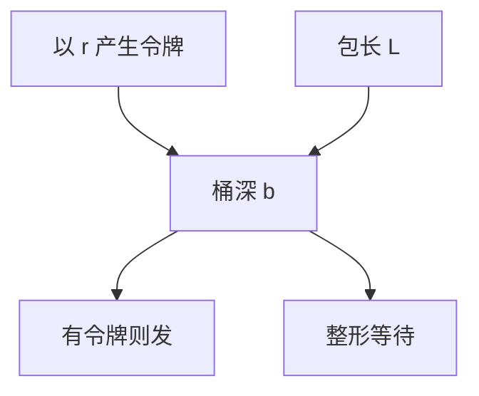

# 令牌桶与整形

速率 $r$、桶深 $b$ 限制平均与突发；整形等令牌，监管丢或染色，给 WFQ 的延迟界提供入口合同。

<footer>—— 据 Turner 令牌桶通识；RFC 2697 / 2698 srTCM/trTCM；Parekh–Gallager 条件整理</footer>

[上一课](/cs/wfq-fair-queue) 的延迟界要流被整形。缺口是**令牌桶**：平均速率、突发、整形 vs 监管。本课不把 DSCP 码点写完。

## 问题

接入合同写 100 Mb/s，但缓冲允许微突发。令牌以 $r$ 产生，桶最多 $b$，发 $L$ 字节耗 $L$ 令牌。无令牌：整形器等待（加延迟），监管器丢或标红。双速三色（RFC 2698）给黄/红。与 AIMD：桶在边缘，cwnd 在端，两者叠加。BDP 突发 $b$ 过小会切峰，过大则瞬间打满下游浅队列（incast 亲戚）。

不要把令牌桶写成加密代币。

RFC 4115 等更新变体。本课钉 $(r,b)$。漏桶对照：恒定出速率。

### $(r,b)$ 合同

整形等令牌加延迟，监管丢或染色。$b$ 无限等于没限。TSO 大段看起来像突发。测速可能只是在量桶。

## 方法

对照：整形 / 监管 / 优先级。画：包 → 扣令牌 → 过或等或丢。与 PAUSE：令牌桶是端或边缘政策，PAUSE 是邻跳反压。

方法止于选定对象与对照；机制才说它如何嵌入已有分层与主干课。

## 机制

WFQ+令牌桶 ⇒ 端到端延迟上界（理论）。DiffServ 用类桶而不是每用户桶。卫星 $r$ 小，$b$ 要能装一个 BDP 突发否则永远喂不饱。TSO 大段会一次扣很多令牌，看起来像突发。

测速：iperf 被边缘桶限，不是路径 $C$。

## 边界

本课不引入层次令牌桶的全部 classful qdisc。DiffServ 是下一课。后课默认：$(r,b)$ 描述突发约束；整形加延迟，监管丢/染色。

合同写 $r$ 却把 $b$ 设成无限，等于没限。

上一课留下的缺口在本课收口；「令牌桶与整形」进入后课词汇表后只引用。文献用来钉对象与边界，不把本课写成该主题的独立综述。下一课[DiffServ](/cs/diffserv-qos)。

## 小结

- 令牌桶钉平均与突发。
- 整形等待，监管丢或着色。
- 与 WFQ 一起才有延迟合同。
- 后课只引用本课钉死的对象，不从该领域总问题重开。
- 出处：RFC 2697/2698；Parekh–Gallager。
