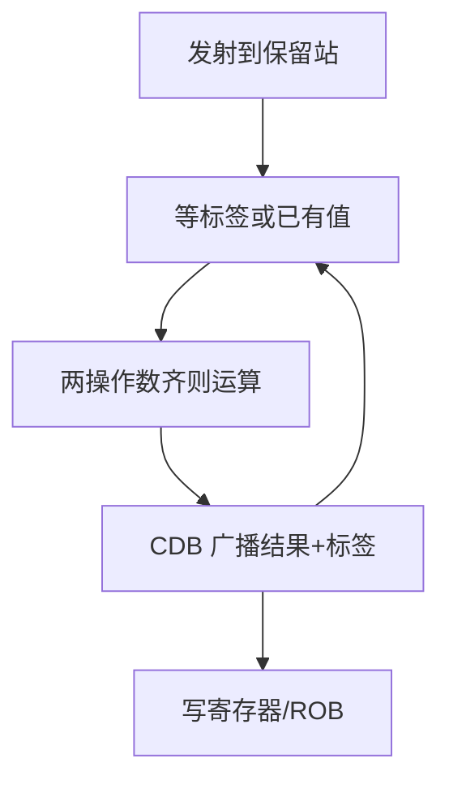

# Tomasulo

保留站记下谁在等哪次运算的结果，公共数据总线一广播标签，等待者自己抓住数据。

<footer>—— 据 Tomasulo, An Efficient Algorithm for Exploiting Multiple Arithmetic Units, IBM Journal 1967 整理</footer>

[上一课](/cs/ooo-rob)规定了 ROB 与按序提交，并把重命名说成「必须有」。本课不重讲提交纪律。缺口是：还没有一套具体的唤醒与分发机制，让「操作数就绪」变成硬件能做的比较。本课只讲 Tomasulo：保留站、标签、CDB。IBM System/360 Model 91 的浮点单元是原文场景；整数乱序核沿用同一思想。

## 问题

ROB 知道指令完成没有，但功能单元怎么发现操作数到了？轮询架构寄存器不够：值可能还在另一单元的输出上，且寄存器已被重命名。缺口不是再加一个提交点，而是**用标签代替寄存器名做数据流握手**。

Tomasulo 原论文为多运算单元与长延迟浮点而写，尚未画现代 ROB；教学上把保留站与 ROB 叠在一起：站负责执行，ROB 负责精确状态。

1967 年的 CDB 是广播总线。当代核用点对点与唤醒矩阵，语义仍是「标签匹配则抓数据」。

## 方法

每条已发射未执行的指令占用一个保留站：存操作码、操作数或「等待的标签」、目标标签。寄存器状态表指出：该架构寄存器的当前生产者是哪一个标签（或值已在寄存器）。运算完成，结果带标签上 CDB；所有站比较标签，匹配则写入操作数并可能变为就绪。

load/store 另有地址序约束，原文用缓冲。本课只要求：RAW 靠标签，WAR/WAW 靠「后来的发射改状态表指向新标签」，旧站仍拿旧标签。

## 机制

这就是数据流：指令不按程序序被挑选，按操作数齐被挑选。与 ROB 结合后，CDB 写 ROB 项，提交仍按头指针。[超标量发射](/cs/superscalar-issue)的宽度变成每拍能填几个站、CDB 能广播几次。

精确异常：冲刷时作废站与标签，状态表回到 ROB 头对应的映射。Tomasulo 原文更关心吞吐而非陷阱；当代实现把两者接上。

## 边界

本课不把记分牌当成另一套主干：记分牌跟踪忙位但不做标签重命名，WAW 要停。也不引入负载值预测。SIMD 与多核不在本课；Tomasulo 解决的是单核 ILP 的唤醒。

后课默认：谈到乱序唤醒，就是标签匹配。下一条路是数据级并行：一条指令吃一个向量。

## 小结

- 保留站 + 标签 + CDB：就绪即执行，RAW 靠匹配。
- 与 ROB 叠放才有精确提交。
- 向量/SIMD 是另一轴并行，下一课才走。
- 出处：Tomasulo, *IBM Journal of Research and Development*, 1967；Hennessy and Patterson, *CA:AQA*。
