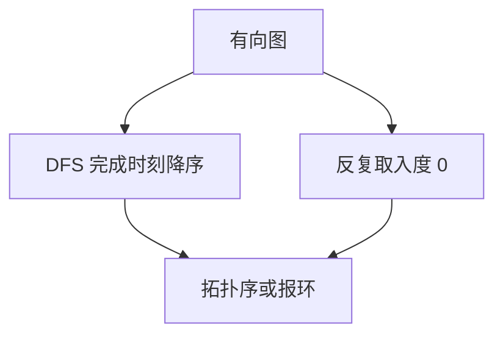

# 拓扑排序

无环有向图的顶点可以排成一线，使得每条边都从左指向右。

<footer>—— 据 Kahn, Topological Sorting of Large Networks, 1962；CLRS 第 22.4 节整理</footer>

上一课[连通分量与桥](/cs/bcc-bridge)证明：有向环当且仅当有反向边。[DAG 与拓扑序预备](/cs/dag-repr)已说明无环才能线性化。本课不重证无环。缺口是：**算法**——给出一个合法顶点序，或报告不可能。本课只交出按完成时刻降序，以及 Kahn 的入度为零队列。

## 问题

任务依赖、编译的符号、包安装，边 $u\to v$ 表示 $u$ 先于 $v$。需要一条总序尊重全部边。有环则不存在。缺口不是再定义 DAG，而是从邻接表在 $\Theta(V+E)$ 内产出序。

DFS 法：做一遍 DFS，按 $u.f$ 降序输出。正确性：若有边 $u\to v$，则 $v.f<u.f$（否则 $u\to v$ 会是反向边，与 DAG 矛盾）。Kahn：反复取入度 $0$ 的点，删出边；若结束时还有点，则有环。

### 拓扑序不是唯一的最短路

同一 DAG 可以有许多拓扑序。BFS 层序不是拓扑序，除非图碰巧是按层编号的。也不要把拓扑序当成加权最短路：那是后课在 DAG 上按拓扑松弛，本课只给序。

Kahn 1962 用入度；CLRS 用 DFS 完成时刻。两者等价于「存在且仅当无环」。并查集课已有的结构这里用不上：环检测走 DFS 或入度，不走连通分量的误用。

## 方法

任选其一。DFS 完成后倒序写表。Kahn 用[队列](/cs/queue-buffer)存当前零入度点。输出长度小于 $|V|$ 则失败。

[稀疏图](/cs/sparse-graph)用邻接表；每次边只降一次入度。

## 机制

序一旦给出，后课可按序做动态规划或松弛：到 $v$ 时全部前驱已处理。这是 DAG 最短路、最长路的共同前置，本课不把松弛写进来。编译课的依赖仍是同一对象：通行证之间的边若成环则无法排程。

多个零入度点时 Kahn 的队列次序决定哪一个合法序；那是平局，不是错误。

## 边界

本课不处理带权边。不写强连通分量缩点后再拓扑——那是把有环图缩成 DAG 的后话。无向图没有拓扑序这一定义。偏序的线性扩张在组合里更一般，本课只做有向图上的算法。

后课默认：DAG 上有 $\Theta(V+E)$ 拓扑序；有环则算法报告失败。正权最短路下一课从另一端（非负权一般图）进入。

## 小结

- DAG 上拓扑序存在；DFS 完成降序或 Kahn 入度均可。
- 有向环则失败；代价 $\Theta(V+E)$。
- 序不唯一；本课不给最短路。
- 出处：Kahn, 1962；CLRS 第 22.4 节。
