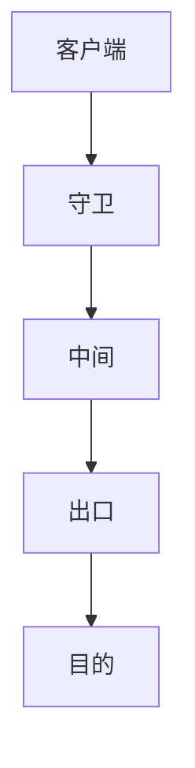

# Tor 洋葱路由

洋葱路由把电路上的每一跳只看见相邻，出口看见明文目的（若无端到端加密）。匿名是概率与威胁模型：全局被动观察者仍强。

<footer>—— Dingledine, Mathewson and Syverson, Tor, USENIX Security 2004</footer>

## 定位

上一课[PIR](/cs/pir)藏索引。缺口是**藏网络身份与路径**。本课 Tor 机制与极限，不写滥用教程。

后课默认已经读完本课钉下的合同，只补差，不从该领域第一性原理重开。

## 问题

TLS 对服务器仍暴露 IP。Tor：三跳，分层加密。缺口是出口策略、时序关联、网桥。

### 端到端仍要

出口到明文 HTTP 则出口看见内容。匿名≠保密。

Dingledine et al. 2004。禁止攻击 Tor 用户的指导。安全经济学下一课换激励。

## 方法

画洋葱封装。对照 VPN（单跳信任）。下一课安全经济学。

图中节点是本课的机制骨架；课程不把图展开成可运行的攻击步骤。

## 机制

路由隐私。经济学下一课解释为何漏洞会留下。

前提写进合同之后，游戏外的误用只当失败模式点名，不在本课写成操作程序。

## 边界

不写去匿名化步骤。安全经济学下一课。

## 小结

- PIR 藏查询；Tor 藏路径与 IP。
- 分层加密；出口模型要写清。
- 全局观察者仍强。
- 下一课安全经济学。
- 出处：Dingledine, Mathewson and Syverson, 2004。
