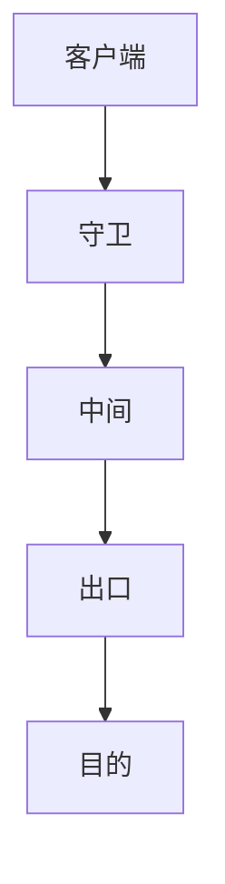
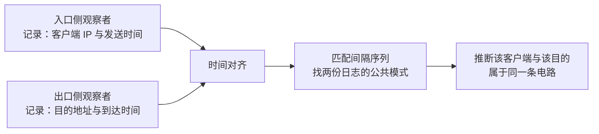

# Tor 洋葱路由

洋葱路由把电路上的每一跳只看见相邻，出口看见明文目的（若无端到端加密）。匿名是概率与威胁模型：全局被动观察者仍强。

<footer>—— Dingledine, Mathewson and Syverson, Tor, USENIX Security 2004</footer>

上一课[PIR](/cs/pir)藏的是数据库下标；本课的缺口是**藏网络身份与路径**——谁在连、连到哪。本课讲 Tor 的机制与极限，不写滥用教程。

后课默认已经读完本课钉下的合同，只补差，不从该领域第一性原理重开。

## 问题

TLS 保护内容，但对服务器仍暴露客户端 IP，对本地观察者连目的都可见。Tor 的回答是三跳电路加分层加密：客户端与每一跳分别协商密钥，报文像洋葱一样逐层加封，每一跳只能剥开自己那层、只看见相邻两跳。缺口是出口策略、时序关联与网桥的可达性。

### 端到端仍要

出口节点剥掉最后一层后转发：若应用层没有端到端加密，出口能看见甚至篡改内容。匿名与保密是两件事——Tor 藏「谁在连」，TLS 藏「说了什么」，缺一不可。

常见误区：以为挂了 Tor 内容就自动加密了。实际上洋葱加密只护到出口为止，出口之后就是明文；网页侧的 HTTPS 是你自己（或网站）开启的另一层，两者管的不是同一段路。

Dingledine et al. 2004。禁止攻击 Tor 用户的指导。安全经济学下一课换激励。

## 方法

方法是把洋葱封装画清楚，再对照 VPN：VPN 是单跳信任，运营者同时看见两端，天然可关联进出流量；Tor 把「同时看见两端」的能力拆给三个互不串通的节点，单看任何一跳都拼不出完整映射。电路按分钟级周期更换，而守卫节点固定一段较长时间，以免频繁换入口反而扩大可关联面。下一课安全经济学。

术语翻译：守卫节点就是你固定使用的第一个中转站。可以想象成总去同一家快递网点寄件——网点认得你，但不知道收件人是谁；换得太勤，反而让更多网点有机会同时看到「你寄件」这件事。

```mermaid
flowchart TD
  CLI["客户端"] --> G["守卫"]
  G --> M["中间"]
  M --> E["出口"]
  E --> DST["目的"]
```

## 机制

路由隐私的根基是信息局部性：守卫知道客户端但不知目的，中间节点两者皆不全，出口知道目的但不知客户端。要把两端连起来，攻击者需同时控制或观察路径的两端——时序关联正是这么做的：在入口与出口同时记录时间标记再对齐。低延迟设计不做批量缓冲打乱，这是 Tor 承认的代价，全局被动观察者因此仍是理论强敌。经济学下一课解释为何已知漏洞长期留在生态里。

数字实例：你 10:00:00.1 发出请求，网站 10:00:00.4 收到；下一条间隔 3.2 秒发出，对侧也恰差 3.2 秒收到。把几十条这样的间隔序列对上，入口与出口两份日志就「咬合」了——这就是时序关联的全部原理。

```mermaid
flowchart LR
  IN["入口侧观察者<br/>记录：客户端 IP 与发送时间"] --> ALIGN["时间对齐"]
  OUT["出口侧观察者<br/>记录：目的地址与到达时间"] --> ALIGN
  ALIGN --> MATCH["匹配间隔序列<br/>找两份日志的公共模式"]
  MATCH --> CORR["推断该客户端与该目的<br/>属于同一条电路"]
```

## 边界

不写去匿名化的操作步骤；边界要点名：出口是明文汇聚点，恶意出口可做内容区分；不用网桥时目录公开列出全部节点，封锁者据此拉黑。安全经济学下一课。

## 小结

- PIR 藏查询；Tor 藏路径与 IP。
- 分层加密；出口模型要写清。
- 全局观察者仍强。
- 下一课安全经济学。
- 出处：Dingledine, Mathewson and Syverson, 2004。
