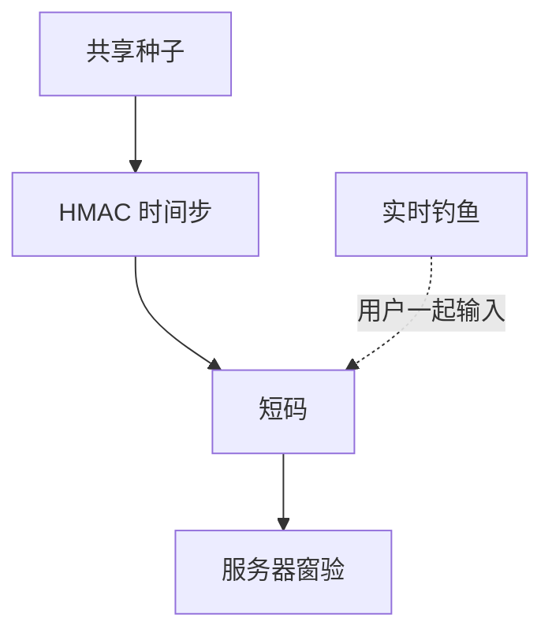
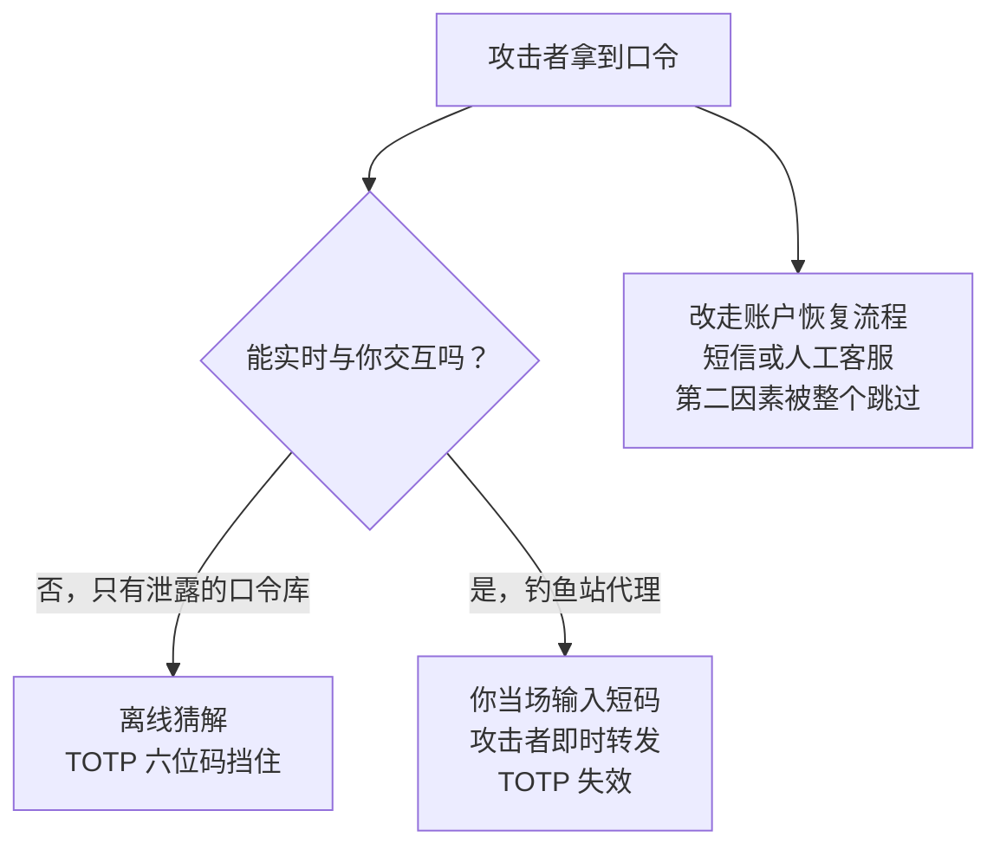

# TOTP 与 MFA

TOTP 把共享种子和时钟窗收成六位数字。它防的是「只要口令」的重放，防不住实时钓鱼与种子备份泄漏。MFA 的强度取决于第二因素是否与第一因素一起被骗。

<footer>—— RFC 6238；RFC 4226 HOTP；NIST SP 800-63B</footer>

上一课[WebAuthn](/cs/webauthn-fido2)给出抗钓鱼方向。缺口是**仍占主导的第二因素**：短信、TOTP、推送。本课钉 TOTP 合同与 MFA 的威胁模型，不写种子提取步骤。

后课默认已经读完本课钉下的合同，只补差，不从该领域第一性原理重开。

## 问题

静态口令泄漏后长期可用。TOTP：HMAC 种子 + 时间步。窗口过大则重放窗变宽；种子进截图与密码库同步则第二因素退化。短信 SS7 不在本课展开，只点名「电话号码不是认证器」。

术语翻译：TOTP 就是「共享密钥 + 当前时间」算出的一段六位短码，每 30 秒换一次——相当于把口令切成 30 秒就作废的碎片，捡到旧碎片也没用。

### MFA 疲劳

反复推送可能逼出一次同意。策略应是数字匹配或 WebAuthn，而不是无限推送。

RFC 6238。NIST 800-63B 限制短信。本课禁止生成伪造 TOTP 的操作指南。时钟来自先前漂移课的粗同步。

## 方法

写验证：允许 ±1 步、一次性使用、种子只在登记时显示。对照 WebAuthn：无共享种子。账户恢复仍是最弱环。

常见误区：以为手机时间和服务器差一秒就登不上。实际允许 ±1 步窗口，即上一个 30 秒窗口生成的码通常也收——所以时钟漂几十秒一般不影响登录，但窗口每放宽一步，重放有效期就多 30 秒。

```mermaid
flowchart TD
  SEED["共享种子"] --> HMAC["HMAC 时间步"]
  HMAC --> CODE["短码"]
  CODE --> WIN["服务器窗验"]
  PHISH["实时钓鱼"] -.->|"用户一起输入"| CODE
```

## 机制

第二因素把「只要口令库」变成「还要第二通道」。实时中间人仍可转发短码。密码破解下一课回到第一因素：口令如何被离线猜。

直觉类比：实时中间人像替你接电话的传话员——你念的验证码，他原样复述给真客服。码是真的、时效也对，只是念的人和听的场景都被调包了。

```mermaid
flowchart TD
  A["攻击者拿到口令"] --> B{"能实时与你交互吗？"}
  B -->|"否，只有泄露的口令库"| C["离线猜解<br/>TOTP 六位码挡住"]
  B -->|"是，钓鱼站代理"| D["你当场输入短码<br/>攻击者即时转发<br/>TOTP 失效"]
  A --> E["改走账户恢复流程<br/>短信或人工客服<br/>第二因素被整个跳过"]
```

## 边界

本课不写短信劫持。密码破解下一课：哈希、盐、慢哈希。

## 小结

- WebAuthn 抗钓鱼；TOTP 是共享种子短码。
- 窗、一次性、种子保管是合同。
- 实时转发与恢复流程可绕过 MFA。
- 下一课密码破解（防御视角）。
- 出处：RFC 6238；RFC 4226；NIST SP 800-63B。
