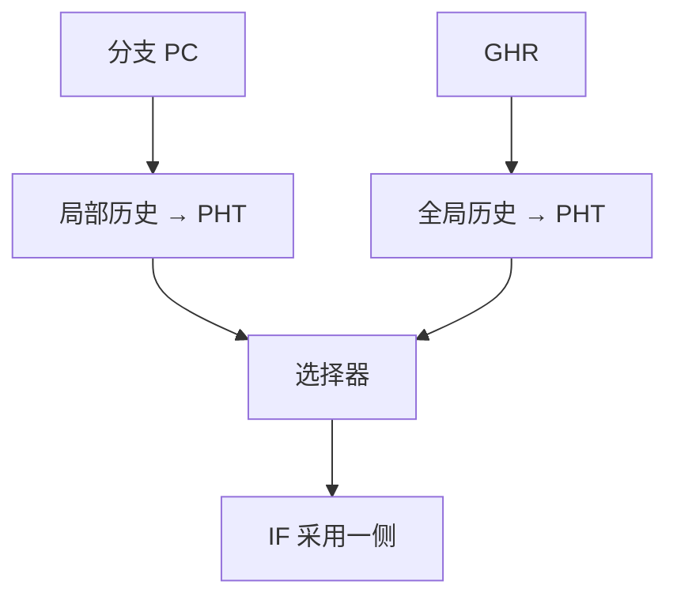

# 两级与锦标赛预测

有的分支跟自己的历史走，有的跟全局模式走；再用一位选择器记下「上次谁对」，比单一计数器更少误预测。

<footer>—— 据 Yeh and Patt, Two-Level Adaptive Training Branch Prediction, MICRO 1991；McFarling, Combining Branch Predictors, WRL TN-36, 1993 整理</footer>

[上一课](/cs/btb-ras)让 IF 拿到目标，方向仍可用一位饱和计数。[控制冒险与分支预测](/cs/control-hazard-predict)已钉「猜 + 核对 + 冲刷」。本课不重讲 BTB。缺口是：一位计数把「这段循环将退出」记成与「循环体反复成功」同一条状态，相关分支互相污染。本课只交出两级自适应与锦标赛（竞赛）选择器。

## 问题

循环末尾的 `bne` 连续多次成功，一位预测器在出口那一次必错。更糟的是：分支 B 的方向依赖于不久前分支 A 的结果（相关），局部一位看不见 A。缺口不是再加大 BTB，而是**用历史寄存器索引一张模式表，每个模式一个计数器**，并承认局部历史与全局历史各有擅长，用选择器在二者间挑。

Yeh–Patt 的两级结构把「历史」与「预测器」拆开。McFarling 的锦标赛再加一个元预测器，记下最近谁赢。

gshare 用全局历史与 PC 异或后再索引，减轻别名。本课把它当作两级全局的一种索引函数，不另立课。

## 方法

局部两级：每个分支 PC 一份局部历史移位寄存器（LHR），用 LHR 索引该分支的模式历史表（PHT），PHT 项是两位饱和计数器。全局两级：全体共享 GHR，索引共享或按 PC 分体的 PHT。

锦标赛：局部、全局各出一个预测，选择器（同样是按 PC 索引的两位计数器）挑一个送给 IF。核对后：正确的一侧强化，错误的一侧减弱；选择器向赢家挪。

更新在提交或核对后进行，与[流水线异常](/cs/pipeline-exception)的冲刷兼容：误路径上的投机更新必须收回或等确认。

## 机制

误预测率进 CPI：频率 × 误预测率 × 损失拍数。两级降低中间那一项；损失拍数仍由流水线深度决定。别名：不同分支撞同一 PHT 项，表现为噪声，加大表或更好的散列（gshare）缓解。

选择器学的是「这类分支信谁」，不是再猜一次方向。循环分支往往信局部；不规则相关信全局。没有一侧永远赢，这是竞赛的动机。

## 边界

本课不把 TAGE、感知机预测器写进主干。也不把预测器做成用户可编程架构状态。延迟槽对照是后课：早期 RISC 用软件填槽，而不是把 PHT 做大。

后课默认：教学核可以仍用一位计数器；谈到「现代条件预测」，默认两级或锦标赛，BTB/RAS 仍管目标。

## 小结

- 两级：历史寄存器索引 PHT，每个模式一个饱和计数器。
- 锦标赛用元预测器在局部与全局之间选择。
- 精确异常与冲刷纪律是下一课；本课只要求投机更新可收回。
- 出处：Yeh and Patt, *MICRO*, 1991；McFarling, WRL TN-36, 1993；Hennessy and Patterson, *CA:AQA*。
