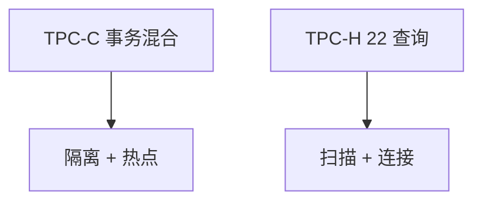

# TPC-C / TPC-H

吞吐数字没有工作负载合同就不可比。TPC-C 钉 OLTP 新订单，TPC-H 钉决策支持的 22 条查询；审计规则比 QphH 数字更重要。

<footer>—— TPC-C、TPC-H 规范；Gray 对基准的警告</footer>

[上一课](/cs/exactly-once)谈流的效果语义。缺口是**如何公平比系统**：分析引擎与 OLTP 引擎不是同一条曲线。本课钉 TPC-C 与 TPC-H；Jepsen 下一课换正确性对抗。不把某厂商宣传数字当定理。

## 问题

TPC-C：多仓、新订单、支付、交单、查询，有隔离与思考时间。tpmC 必须带性价比与审计。TPC-H：3NF schema、22 条、SF 规模因子，中间禁止改查询意图。缺口是读懂**禁止事项**（物化哪类、刷新规则），否则「更快」只是换了题。

TPC-DS、TPC-E 是后继形状，本课只钉 C 与 H 两条经典轴。列存对 H 极友好，对 C 的点更新不自动友好。

## 方法

跑基准：按规定装载、预热、测量窗口、报告。读别人的数字：SF、并行、是否允许物化视图、硬件。与星型/立方：H 的部分查询接近星型变换；C 是短事务+热点。与湖仓：H 可以跑在表格式上，但装载与刷新规则仍要声明。

## 机制

C 的瓶颈常是锁、日志、热点仓与组提交。H 的瓶颈常是 join 顺序、扫描、shuffle、统计。同一存储引擎很难两条都第一——这是 OLTP/OLAP 分叉，HTAP 用双路径而不是一份数字。列存对 H 极友好，对 C 的点更新不自动友好。计划回归在 H 的 22 条上极可见；缓冲 2Q 在 C 上抗扫描。

读报告：SF、节点数、是否允许物化、耐久档（fsync 是否开）、隔离级别。关 fsync 的 tpmC 与规范 D 不符。NewSQL 要用跨仓事务比例解释扩展，不是只报单仓。

## 边界

本课不教如何把基准改到刚好过审计的擦边球。下一课 Jepsen 测的是隔离谎言，不是 QphH。真实倾斜可能比规范生成器更狠，基准是合同不是生产副本。

后课默认：比性能先对齐基准与 D/隔离。无规范的自造基准常优化到演示查询。

## 小结

- 没有合同的吞吐不可比；先读 TPC 禁止项。
- C 对事务热点，H 对分析计划。
- Jepsen 下一课。
- 出处：TPC-C / TPC-H 规范；Gray 对测量。
