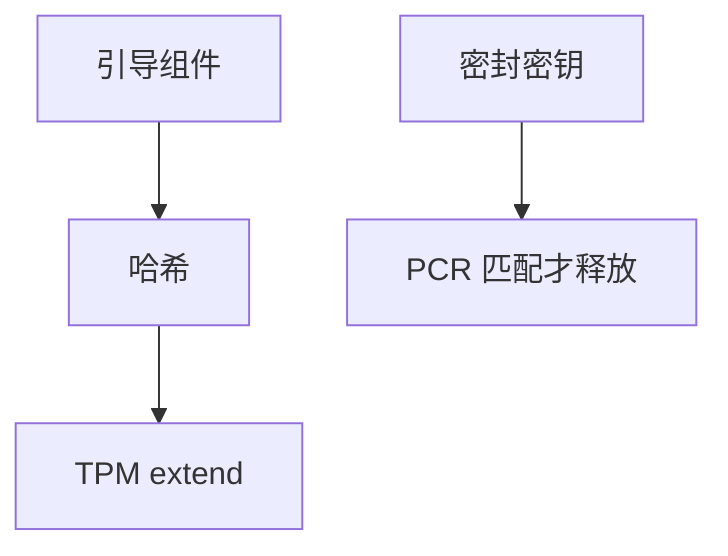

# TPM 与度量启动

度量启动把引导组件的哈希扩展进 TPM 的 PCR：密封密钥只在 PCR 符合预期时解开，从而把「启动了预期的代码」接到密钥。

<footer>—— 据 TCG 对 PCR 扩展的说明；Linux IMA/EVM 与 systemd-cryptenroll 实践</footer>

[安全启动](/cs/secure-boot) 是「验签放行」。度量是 **记录实际跑了什么**。缺口是 TPM PCR、密封、与 [dm-crypt](/cs/dm-crypt) 解封。

## 问题

PCR 只能 extend 不能随意写。启动器把 grub、kernel、cmdline 哈希进去。缺口：策略 PCR 集合；远程证明 quote；IMA 继续度量运行时文件。本课不把 TPM 2.0 命令表当作业。

更新内核会改 PCR，未更新策略则盘解不开——这是特性不是 bug。对象是硬件信任根。

## 方法

boot 路径 extend → 用户 `unseal` 密钥 → 开 LUKS。对照 cap：运行时特权。对照 audit：PCR 在芯片里更抗篡改。对照 KPTI：无关。

## 机制

TPM 把启动完整性变成密钥释放条件，使冷启动攻击更难（不完美）。不要写成军用认证。与 [热插拔](/cs/memory-hotplug) 无关。与网络远程证明是同一 PCR 的出口。

PCR 预测错误是部署第一痛。

实现上：PCR 扩展不可回退，升级内核必须同时更新密封策略。quote 把 PCR 签给远端，但要验 TPM 密钥链。IMA 把度量从启动延续到运行时文件。 读法上只引用[上一课](/cs/secure-boot)的结论，不把对象换成训练推理或限价簿。

本课在操作系统进阶的「安全、启动与调试 / 内核安全与启动」课序里，对象是 **TPM 与度量启动**。

- 先修只引用，不重导：上一课的结论当公理，本课只补差。
- 五栏不吞并：不把本课写成大模型训练/推理，也不写成限价簿或权重量化。
- 文献用 OSTEP、McKusick、内核文档与具名会议论文；不发明 arXiv 编号。

## 边界

本课不引入全部 NV index。不保证虚拟 TPM 与硬件同等。下一课根文件系统如何切进来：initramfs 与 pivot。

版本字段会变，课序钉的是机制对象「TPM 与度量启动」，不是某一主线内核的结构体名。
后课默认：PCR 可密封磁盘密钥。早期用户空间与切换根，下一课 initramfs。

## 小结

- 度量启动把哈希扩展进 PCR。
- 密封把密钥绑到预期启动状态。
- initramfs/pivot 是下一课。
- 出处：TCG；IMA；systemd TPM；LUKS。
