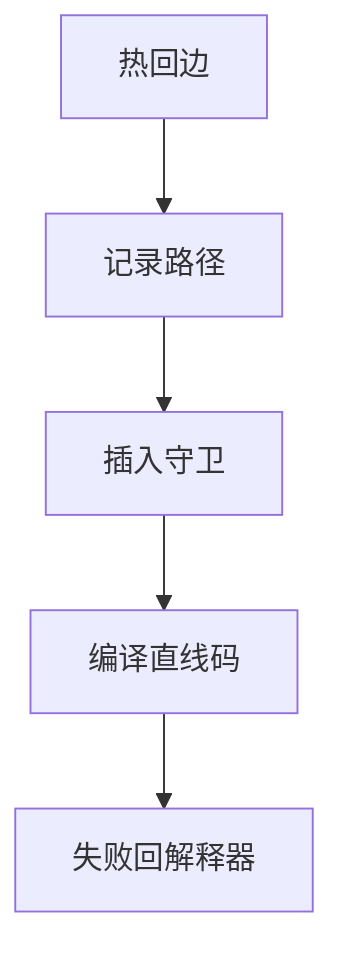

# 追踪 JIT

记录热循环走的一条路径（trace），编译成直线代码，用守卫处理偏离。单位是路径，不是整个方法。

<footer>—— 据 Gal, Eich et al., Trace-based Just-in-Time Type Specialization for Dynamic Languages；Bala, Duesterwald and Banerjia Dynamo 整理</footer>

上一课[方法 JIT](/cs/method-jit) 编译整个方法，含冷枝。缺口是**追踪**：只编译反复走的边序列，动态语言上特别有效（类型沿路径稳定）。本课钉记录、守卫、trace tree，内联缓存下一课。

## 问题

方法里 `if` 多，编译全部浪费。Trace：从热回边开始记录字节码直到回边闭合。偏离守卫：类型或分支不同则退出到解释器。缺口是**路径 IR**，不是方法 CFG 全编译。

Dynamo 对 native 二进制做同类；JS 引擎曾用 TraceMonkey。

### 追踪不是软件流水

软件流水是静态循环核；trace 是动态记录的路径，可跨方法调用（inlining 在记录里发生）。

Gal et al. 2009（TraceMonkey）。Dynamo 2000。SPUR、RPython 元追踪点名。本课不写元 JIT 全文。

## 方法

解释时在热循环启动 recorder。生成 SSA-like 线性 IR。编译。出口桩。嵌套循环：inner trace 或 abort。

与方法 JIT：混合（HotSpot 不以 trace 为主）。路径太短或守卫太密则放弃。

## 机制

副作用：记录时已执行，编译码要等价重放——小心。异常与 GC 安全点：trace 上要能停。不要无限记录多态路径。

代码膨胀：每条热路径一份。

## 边界

本课不写去优化。后课默认：热路径可 trace 编译。下一课内联缓存：另一种投机，粒度是调用点。

也不把 trace 当分布式 tracing。

## 小结

- 追踪 JIT：编译热路径 + 守卫退出。
- 适合类型沿路径稳定的动态语言。
- 与方法 JIT 可混合。
- 出处：Gal et al.；Dynamo（Bala et al.）。
