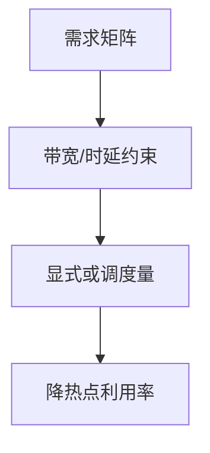

# 流量工程

最短 IGP 度量会把流量堆到最宽的树上；流量工程用另一套约束（带宽、时延、着色）把需求矩阵搬到链路上，使热点下降。

<footer>—— 据 RFC 3272 综述；OSPF-TE / RSVP-TE 实践；Kurose and Ross TE 节整理</footer>

[上一课](/cs/internet-ixp) 画出 AS 图。域内同样会挤：ECMP 哈希仍可能打满一条。缺口是**流量工程**：与「最短路」分离的显式路由或度量调整。本课不把 MPLS 标签栈写完，下一课才是 MPLS。

## 问题

OSPF 代价若只按接口带宽设，所有需求仍可能共享同一条低代价边。TE：测量需求 → 算约束最短路或多商品流近似 → 用 RSVP-TE 建 LSP，或调 IGP 度量，或用后课 SR。目标常是最大链路利用率最小，不是单流跳数最小。与 HOL：那是微秒级结构；TE 是分钟到小时的矩阵。

不要把 TE 写成「买更大的口」唯一解：口更大后最短树仍可能挤。

RFC 3272。Fortz–Thorup 等讨论度量优化。本课不解整数多商品流。

### 最短树会堆热点

度量、LSP 或 SR 把需求矩阵搬开。过频调度量会抖 IGP。域间 TE 是属性，不是 Dijkstra。

## 方法

对照：调度量（全局副作用）vs 显式 LSP（局部）。画：需求矩阵 → 约束 → 转发路径。IXP 出口选择是域间 TE：MED、AS-PATH prepend、更长前缀（谨慎，RPKI maxLength）。

方法止于选定对象与对照；机制才说它如何嵌入已有分层与主干课。

## 机制

BGP 决策仍选出口；TE 决定出口之后域内怎么走。卫星链路带宽贵，TE 更要避开误码高的入口。切片 5G 是无线侧预留；这里是 IP/MPLS 预留，对象类似、层不同。

ECMP 是无状态分流，TE 可以有状态；后课会对比 SR 的无状态中间节点。

## 边界

本课不引入 PCE 的全部 PCEP。MPLS 是下一课。后课默认：TE 把约束放进选路，IGP 最短只是其中一个解。

过频调度量会引起 IGP 与 BGP 震荡，像人为抖动。

上一课留下的缺口在本课收口；「流量工程」进入后课词汇表后只引用。文献用来钉对象与边界，不把本课写成该主题的独立综述。下一课[MPLS](/cs/mpls)。

## 小结

- 最短 IGP 树不等于均衡负载。
- TE 用度量、LSP 或后课 SR 搬流量。
- 域间 TE 是政策属性，不是 Dijkstra。
- 后课只引用本课钉死的对象，不从该领域总问题重开。
- 出处：RFC 3272；OSPF-TE 实践。
