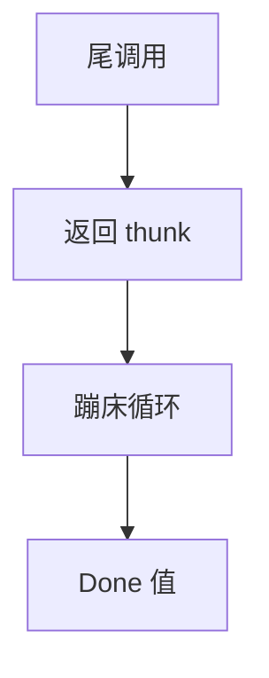

# 蹦床与尾递归

宿主语言不保证尾调用时，把「下一步计算」做成 thunk 返回给循环：蹦床反复调用，栈深度保持常数。

<footer>—— 据 Steele 尾调用讨论；Baker, Cheney on the M.T.A.；对照[尾调用优化](/cs/tail-call-opt) 与 CPS 整理</footer>

上一课[协程](/cs/coroutines-impl) 用帧暂停。缺口是在**无 TCO 的宿主**（Java、C# 历史、JS 引擎不完全保证）实现 Scheme 式互递归：蹦床。虚表下一课。不重写 CPS 变换全文。

## 问题

CPS 后全是尾调用，若 `call` 真的建帧则爆栈。蹦床：函数返回 `Bounce { thunk }` 或 `Done { value }`，驱动循环 `while (bounce) thunk()`。缺口是**驱动器**，不是 yield 状态机。

Cheney on the MTA：用垃圾回收当栈——极端蹦床，点名。

### 蹦床不是协程的 yield

yield 把控制交回调用者并保存局部；蹦床通常不把中间结果交给用户，只给驱动器。用户看来仍是一次 `eval`。

Baker 的 MTA。Steele。SML 编译到 C 的历史技巧。本课工程补丁，优先仍是真 TCO。

## 方法

约定：尾位置不调用而返回闭包。驱动：循环直到 `Done`。与闭包转换：thunk 即闭包。性能：间接多，可批处理若干步。

与 JIT：宿主若能识别驱动循环，仍难内联互递归。真 TCO 更好。

## 机制

调试栈无意义。异常：要穿过驱动器。不要在 thunk 里无意非尾调用。

与生成器：可把蹦床当无用户可见暂停的协程驱动。

## 边界

本课不写虚表。后课默认：无 TCO 时用蹦床保栈。下一课虚表与动态分派。

也不把蹦床当体操。

## 小结

- 蹦床：返回 thunk + 循环，模拟 TCO。
- 性能差于真尾调用；用于宿主限制。
- thunk 是闭包。
- 出处：Steele；Baker MTA；对照 Appel CPS。
