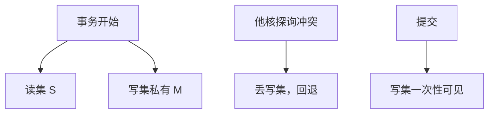

# 事务内存

用 cache 的独占与共享跟踪读集写集：提交时若没有冲突则一次性对全局可见，否则丢掉推测写，像误预测一样恢复。

<footer>—— 据 Herlihy and Moss, Transactional Memory: Architectural Support for Lock-Free Data Structures, ISCA 1993 整理</footer>

[上一课](/cs/acquire-release) 用锁的两端串可见性，锁本身仍是真共享行上的争用。[原子](/cs/atomic-cache-impl) 一次只罩一个地址。本课不重讲 dmb。缺口是**硬件事务内存（HTM）：把临界区里的多行读写当成可提交或可放弃的一块**，用 cache 状态当读集/写集。

## 问题

细粒度锁难写；粗粒度锁把伪共享变成真串行。无锁算法用 CAS 循环，可组合性差。Herlihy–Moss 的提案：指令标明事务开始/结束，硬件保证「看起来原子」。缺口不是更强的 fence，而是**用已有的一致性探询检测冲突：他核对你读集的写、或对你写集的任何访问，导致 abort。**

Intel TSX（RTM/HLE）把 L1 当写缓冲：容量溢出、异常、某些指令都会 abort，软件必须有回退路径。这是有限 HTM，不是无限理想事务。

## 方法

事务中：load 把行留在 S/E 并加入读集；store 把行升到 M 但**不对外提交**（可把数据放在 L1 私有副本）。探询打中读集或写集则 abort：冲刷写集，像 [推测恢复](/cs/speculation-recovery)。提交：写集一次性变成全局 M 可见，或靠「提交前检查读集仍有效」。

## 机制

与 ROB 推测的差别：事务跨越的是**内存行**，可以比 ROB 窗口长，但受 L1 容量限制。与锁：无冲突时无锁字颠簸；有冲突时 abort 重试可能活锁，需要指数退避或回退到锁。不能把 HTM 当成可以省略 [acquire/release](/cs/acquire-release) 的魔法——失败路径仍是锁。

禁止在事务里做的事（I/O、某些特权、过深嵌套）来自「写集无法回滚外部世界」。

## 边界

本课不把 STM（纯软件）当微结构主干。也不提供可运行的锁省略攻击或侧信道利用；事务 abort 会改 cache，安全课可再引用。下一课把显式 fence 的周期数钉下来：没有事务、没有锁时，程序员仍会下栅栏。

后课默认：HTM 用 cache 做多行推测原子，容量与指令集有限。显式 fence 仍是最可控的顺序工具，但很贵。

## 小结

- HTM 用读集/写集与探询做冲突检测，提交或 abort。
- 容量与禁止指令强制软件回退。
- 显式 fence 的微结构代价是下一课。
- 出处：Herlihy and Moss, *ISCA*, 1993；Intel TSX 公开文档。
