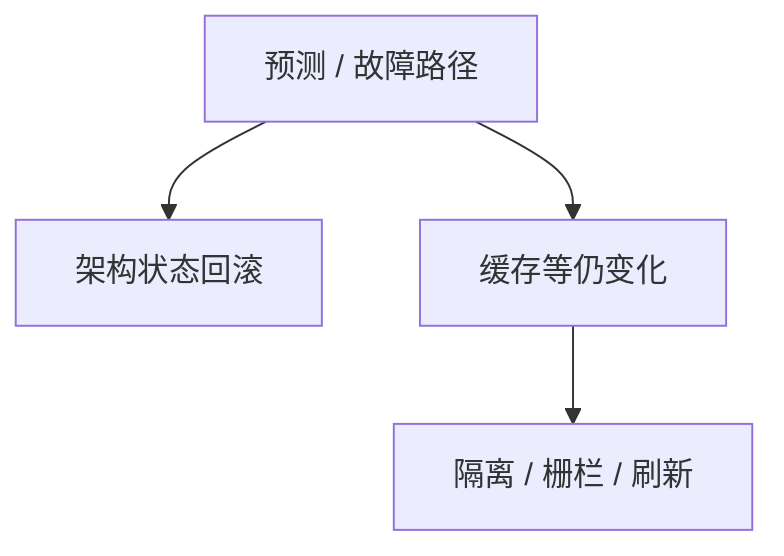

# 瞬态执行对照

预测执行可以在架构状态回滚之后，仍在缓存与缓冲里留下可测差异；隔离规格若只写寄存器与页表，会漏掉这一层。

<footer>—— 据 Kocher 等与 Lipp 等对瞬态执行的公开叙述；Anderson 对侧信道扩展威胁模型</footer>

[上一课](/cs/side-channel)把时间、缓存、功耗标进模型。本课不重列计时。缺口是微结构：[乱序](/cs/ooo-rob) 与[分支预测](/cs/control-hazard-predict) 会让指令在提交前执行，失败路径被丢弃，但缓存占用还在。对照的是机制与防御（隔离、刷新、栅栏、关预测），不是可运行的探测程序。TLS 握手下一课回到协议。

## 问题

侧信道课留下「非规格输出」。瞬态执行：错误预测或故障路径上的加载仍会填缓存，架构寄存器随后像没发生。跨特权、跨进程的机密可能被编码进命中/未命中。缺口是**把组成课的预测器接到威胁模型**，并声明本栏只讲机制与缓解，不提供复现步骤。

Meltdown 式故障抑制与 Spectre 式预测是两条公开叙述。防御包括内核页隔离、微码、序列化、分区缓存。没有一种栅栏取消全部预测收益。

## 方法

设计：敏感代码常时间、不按秘密分支、不按秘密索引缓存。系统：地址空间隔离加强、共享页谨慎、SMT 共核当作同一信任域或关掉。规格：把「架构上看不见」改成「微结构也要预算」。本课不给测量代码。

## 机制

瞬态执行让 CIA 的 C 在「页表已隔离」时仍可能失败。引用监视器看不到缓存。后课 TLS 保护的是链路上的字节，不自动保护同机微结构。组成课的性能机制在此变成安全边界。

## 边界

本课不把每一次公开变体的名字列成考试。网络上如何协商密钥与证书，下一课 TLS 握手。

后课默认：侧信道含瞬态执行。会话保密从握手开始在链路上收口。

## 小结

- 瞬态执行把预测器变成泄露面。
- 防御是隔离与限制推测，代价是性能。
- TLS 握手下一课。
- 出处：公开的 Spectre/Meltdown 叙述；Kocher 计时一线；Anderson。
