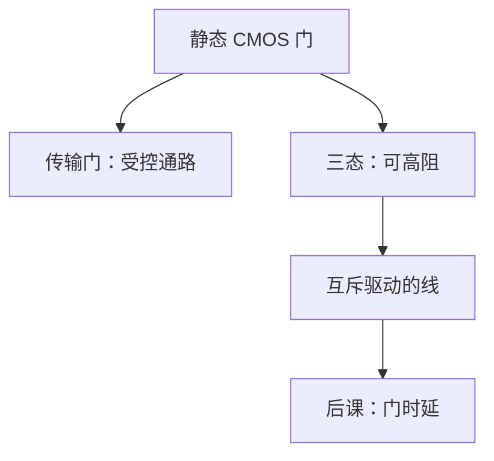

# 传输门与三态

互补 CMOS 门总要把输出钉在轨上；传输门把通路打开或切断，三态则允许把线让给别人驱。

<footer>—— 据 Harris and Harris, Digital Design and Computer Architecture 整理</footer>

上一课[与或非与万能门](/cs/nand-universal)钉死了 NAND/NOR 能拼任意布尔函数。本课不重证完备，也不从模拟开关电阻另起。缺口是：后课总线、寄存器旁路、多路选择，经常需要**不驱动**某根线，而不是再做一个总在推 0/1 的门。

## 问题

静态 CMOS 输出在稳态靠近电源或地，两块若接到同一节点会对打。缺口是两种受控连接：传输门（nMOS+pMOS 并联，栅相反）导通时近似双向通路；三态缓冲在使能无效时输出高阻 $Z$，使能有效时等同普通缓冲。多驱动线必须互斥使能，否则争用。

本课只钉通路与高阻。延迟、负载计入[下一课](/cs/gate-delay)。MUX 可用传输树或门级，后课再命名。

### 高阻不是「第三种逻辑 1」

$Z$ 表示没人推，线上电压由电容保持或被别人驱，不是合法数字值。把三态当 ternary 逻辑，后课总线会把浮空当数据。传输门导通时两端都应是强 0/1，弱电平经传输管会再衰减。

Harris 用传输门做小型 MUX，用三态做总线。本课不把动态逻辑、多米诺当主干。双向引脚是三态的封装形态，协议仍是互斥驱动。

## 方法

传输门：两管互补开启，通过强 0 与强 1。三态：使能与数据经与非/或非再接到互补输出级，或输出级本身可关断。总线：若干三态接同一节点，译码保证同一时刻至多一个有效。

## 机制

有了高阻，组合连接不再只是门输出对门输入：还可以把多块的输出接到同一点再选通。后课寄存器堆读口、外设总线都靠这层。功能上仍可用 NAND 网模拟 MUX，面积与走线不同。传输门本身几乎不恢复电平，长链要插反相器——这是延迟课的负载，本课只承认。

## 边界

本课不讲 I/O 标准电压、漏极开路与上拉电阻的模拟细节（承认开漏是另一种「线与」）。不引入模拟乘法器式的传输特性。

后课默认：组合块除了推轨，还可以切断；总线必须互斥。任意组合功能至此都能落成门网或传输/三态网；时延下一课才量化。

## 小结

- 传输门是受控双向通路；三态输出可高阻。
- 同一节点多驱动必须互斥，否则争用。
- $Z$ 不是第三种逻辑值。
- 出处：Harris and Harris。
